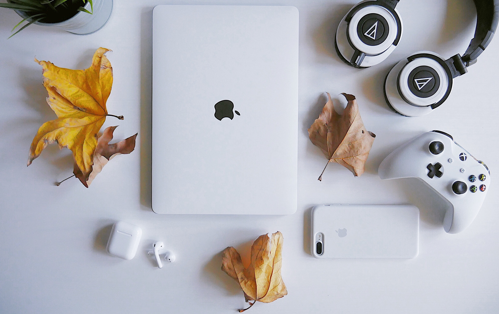
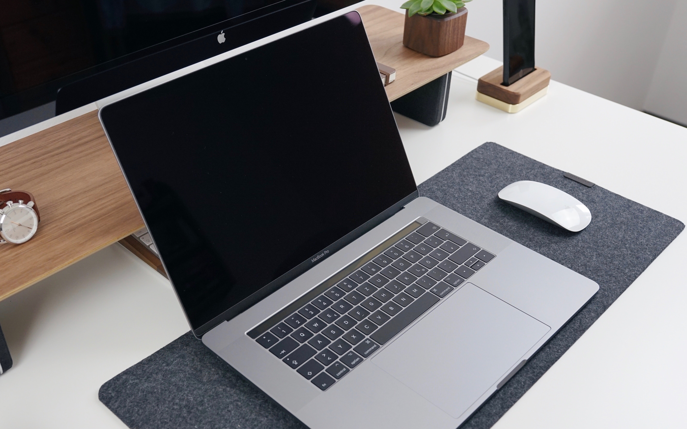
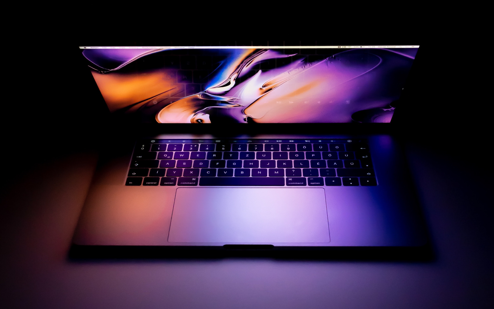
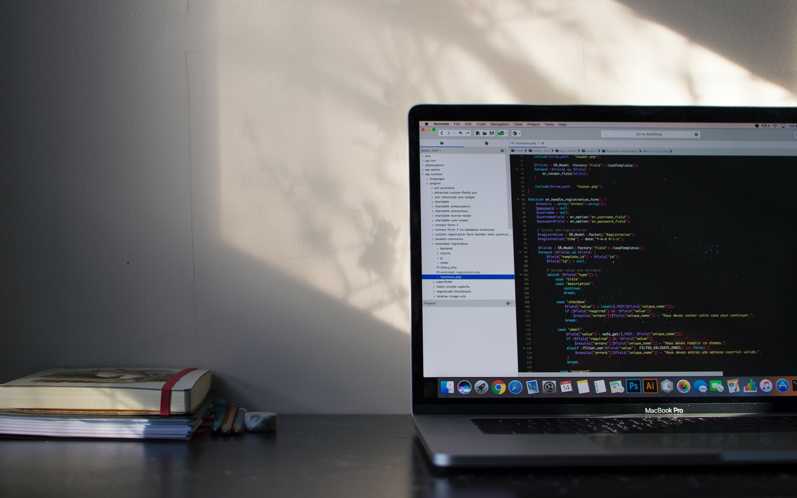
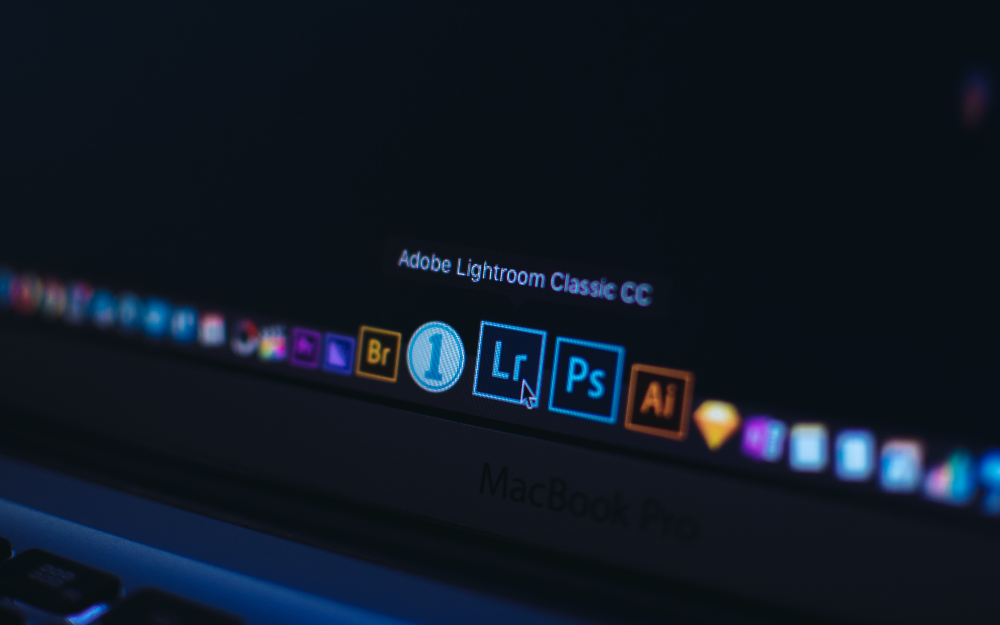

> 无论你是一个 IT 工程师，还是一个文字工作者，又或者只是一个学生党或 Office 使用者，相信你一定有很多次的被别人推荐使用 Mac：不管是现实中或是在社交媒体上。甚至自己也了解过 Mac、考虑过是否能用 Mac 来办公。这篇文章的目的是用来打消你买 Mac 的念头，如果看完这些你还是想买一台属于自己的 Mac 的话，那么你可能真的需要

首先需要说明的是，我现在说的 Mac **不是按支算的那种**。所以如果你看到标题进来，下面看了一些云里雾里的文字，就不好了。如果你印象中的 Mac 能按支、箱等单位算，麻烦请绕道非常赚钱的美妆博主，这里说的 Mac 是苹果公司的电脑。

好了，废话说完了，下面进入正题，从几个简单的方面说一下买 Mac 会考虑的几个问题吧：

## 价格

说到苹果电脑，不得不说价格问题。因为很多人（至少对我）来说，得几个月工资才能买一个中配的 `MacBook Pro`。就算是 6k 多的 `Mac mini` 也得我一个月工资呢，如果你觉得 `Mac mini` 这价格也可以，我也没话说，但是那就定位成台式机了，4k 块钱配一个性能很好 PC 够用好几年的了。所以价格在很多时候都是我们进入苹果世界的拦路虎，这个因素是不可忽略的。

不过也有可能**价格贵不是它的缺点，而是我的缺点**。如果你觉得还能承受，那么请继续往下看。

## 颜值

颜值就不用多说了，如果说苹果电脑第二的话，目前我觉得没有其他电脑敢说第一。当然，不排除个人审美不同导致的差异。

如果你非要拿 19 年新出的 `Mac Pro` 说事的话，我也只能呵呵。毕竟有很多时候我们理解不了的审美：就像 `iOS 7` 扁平化设计刚出来的时候，很多人喊丑，后面大家都扁平化了，反而觉得拟物化的设计看不下去了。

所以谁知道多少年后我们不会一下子就理解了这种设计呢，到时候大家可能不会再认为它是用来刨萝卜丝的吧？

你可能会说，**颜值高**难道也是缺点，也能阻止我买 Mac 的步伐？

那肯定了呀，你想想，如果一件东西很贵，但是很丑，你一点买的欲望都没有，那跟你也没有啥关系；但是如果一个东西贵一点点，但是却非常漂亮，这时候你就会非常纠结了。

注意，当你喜欢上了一个颜值高但是贵的电脑，这段感情才是最要命的，因为这时候你就要看好你的钱包了。

## 做工

如果你拆过 `MacBook Pro`，或者像我一样看别人拆过，你就会惊叹：原来电脑内部零件还可以这样严整，空间利用简直恰到好处。

嗯……稳住，别激动。虽然外面看着漂亮，但是里面也看着舒服呀。啊，我好像用错关联词了哈。

不过我还是劝你淡定一点，你可以压抑住自己内心的真实想法，跟着我慢慢说：嗯，**做工**是比其他电脑**好一点点**吧。

又注意：里面做工外面有看不到，不要因为这心动，钱包更要看好喽。

## 屏幕

说到 Mac，屏幕也是要多一嘴的，如果你去买个 `Mac mini`，然后搭个 1920 × 1080 的屏幕，那你还是别买屏幕了，让 Mac 休息一会儿吧，它可能有点心情不好。

如果你买个 `MacBook` 系列，或者买`iMac` 系列的，视网膜屏的电脑会让你的**眼睛舒适度上升一个档次**，看其他低分辨率的屏幕：我去，我怎么能看到像素，还能看到很多马赛克呀（这里说的是一般的笔记本电脑哈，现在 2k、4k 各种屏幕当然也看着挺顺眼了）。

这能成为我不买 Mac 的原因也很简单：我买一台可以，但是如果我买过一台了，体验过它的好之后，后面没钱再买了，我拿什么拯救我挑剔的眼睛？

就像你看惯了 4k 的视频，现在让你看 480 × 320  的视频，是不是感觉很不舒服。但是如果你一直看的是这种*小视频*，反而觉得没有啥不对。

最让人难受的不是得不到，而是曾经拥有。

说完苹果电脑自身的硬件条件，再来说一下使用体验吧。

## 有点装X

在若干年前，苹果的电脑还很罕见、用的人相对很少的时候，大家看到有人在用 Mac 之后，要么在心里说一句：装逼；要么在心里默默的羡慕；而大部分两者兼而有之。

如果说那时候谁在星巴克或者图书馆，掏出来一台 Mac，不管是喝杯咖啡、或者旁边摆一本看着很文艺的书，亦或啥都没有，就一台电脑，看着也是**相当装X**了。

放到现在，大家见的多了，甚至自己也在使用，所以也就没有之前那么的吸睛了。大部分用 Mac 的是像我一样的码农，但是在相同的公共场合拿出来，还是比其他品牌的电脑多一些辨识度的。

像我这样的，看到别人用 Mac 的时候，还是会看一下是新款还是旧款，是 13 寸的还是 16 寸的（毕竟我没有自己的 Mac 😭）。

放到现在其实还是**有点装X**的，这样的结果可能就是给人一种：“Emm……，这个人不清真，有点装” 的感觉。

大家都这样想了，还怎么跟你愉快的做朋友，是吧？

## 不能打游戏

也不是说完全不能打游戏，在 Mac 平台的游戏也有很多，你可以在 `MAS`（*Mac App Store*）找到很多，还有 Steam 上，也有很多很好的游戏，而且时不时还来一波限免，所以如果你想玩肯定让你玩个够。

但是，像 LOL、吃鸡、穿越火线这些个目前有些火，或者小朋友喜欢的游戏就不用想了。原因很简单：游戏不支持。

我在网上遇到一个编程的大牛，各种语言、底层原理知道的很多，我就问大牛为啥这么厉害。大牛跟我说：“上大学的时候我买了人生中的第一个 Mac，别人都在 Windows 上打游戏，而 Mac 不能和人家一起玩。于是乎就各种 C、C++、Python、前端学了一下，就这样喽～”。这样说的我都想上小学的时候就有一台 Mac 了😂。

所以如果你是打游戏的话，还是不要买 Mac 了，安安心心去组装个台式机玩吧。

## 没有开发环境配置的乐趣

如果你是一个开发者的话，而且你在 `Windows` 上配置过开发环境，那么你一定经历过各种环境变量的配置。而且配置完之后你就忘了，下次需要的时候，还得拿出来文档或者搜索引擎（注意，我说了搜索引擎，但是没说是什么搜索引擎，原因你懂的）再搜索一遍。

配置开发环境，这是多么神圣又幸福的一件事情呀，怎么能像在 `macOS` 上面**一行命令就搞定**呢，一点成就感都没有，还是 `Windows` 有仪式感。

## 没有装机的乐趣

除了环境变量，你会发现你用了一段时间的 `Windows` 系统怎么配置都没办法运行一些程序，无论是开发环境或者什么专业的软件。

那么这时候更有仪式感的事情将要发生了：你要重装系统。原因也很简单：重启电脑可以解决 90% 的问题；重装系统可以解决 99% 的问题；剩下的 1% 的问题需要重新购买来解决了。既然重启解决不了，那就再试试重装喽。

就像 `Android` 刷机一样，一个**不用隔三差五重装系统**的电脑，会有什么乐趣呢？

如果用 Mac 的话：快乐是他们的，我什么都没有。

## 别装 Windows

啥？你跟我说上面都不是问题？有颜值、做工、Logo 就行了？你还要装 Windows？

我劝你不要这样……

这样可能会把很多果粉气个半死的（我不是果粉，但是我也觉得看不下去了）：没有 `macOS` 的苹果电脑是没有灵魂的。或者说：你用一个很贵的价钱买了一个不怎么值的电脑——这样是不会幸福的。

苹果电脑的优势就是硬件和 `macOS` 的完美结合，让人用起来非常的舒服。如果你是一个文字工作者、设计师或者音乐人之类的，一定要尝试一下 ` macOS`。因为她能让你沉浸在你的工作或者创造中，**没有各种卫士的打扰，更没有各种弹窗的烦恼**。而且，我忘了说了，**Mac 的音质，也是相当好的**。

“以前上网中木马，现在上网中卫士”这种和木马、各种卫士斗智斗勇的快感，你在 Mac 上大致是体验不到了。唉，想想是多么悲哀的一件事情。

## 系统

嗯，没有 `macOS` 的苹果电脑是没有灵魂的。苹果系统的颜值也不逊于外观。而且，现在用的人越来越多了，竟然有一种很魔性的操作：各种教程在教怎么在 `Windows` 上配置成 `macOS` 的优雅的界面；还有很多教程在教怎么在 Mac 上保持在 `Windows` 上的使用习惯。

前面我觉得无可厚非，毕竟就大概率上来说，`macOS` 的系统和软件是各大厂和设计师模仿的典范。后者嘛，完全没有必要，因为好用就行了，也许之前的习惯都是不正常的呢？

我劝你还是好好用 `macOS` 比较好。

苹果电脑的优势在于**用户界面和命令行的完美结合**，用某老师的话来说就是：**漂亮的不像实力派**。

* 不用清理
* 不用卫士
* 不用关机
* 没有弹框
* 没有病毒
* 没有烦恼

请使用罗老师的语气在上面这几条前面加个*几乎*，谢谢。

## 总结

很抱歉，其实你看完会发现，除了价格因素，我还是比较倾向于买 Mac 的，请原谅我的安利😂。

话说回来，如果你没有体验过的话，你一定要体验一下没有过过的生活嘛！

那么，你太多的问号已经没有了吧，你已经懂了我为什么不买 Mac 了吧？

是的，瞒也瞒不住了：我不买 Mac 的原因只有第一条：穷。

