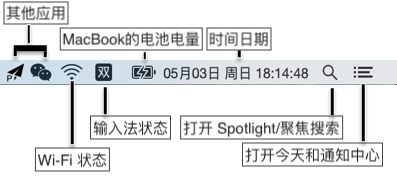
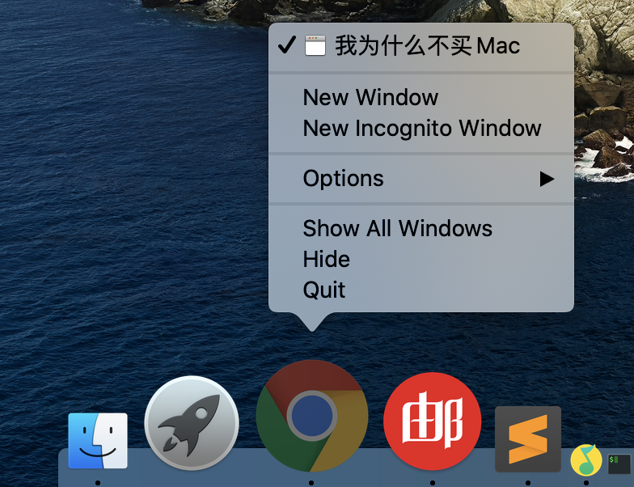
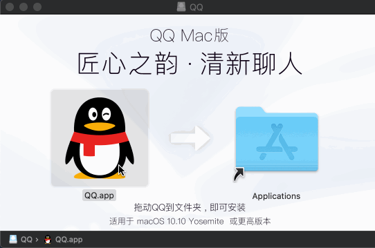
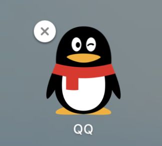
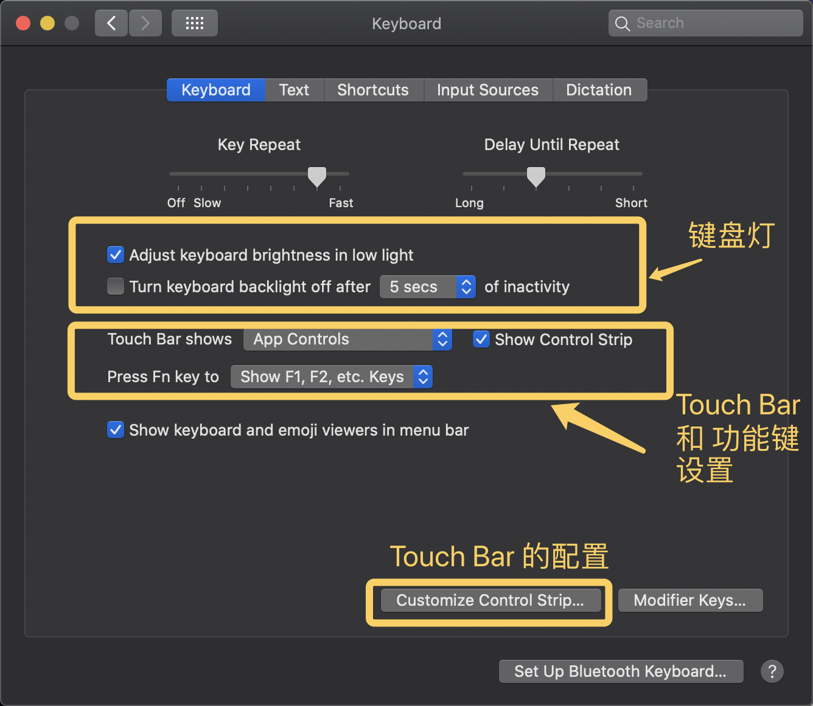
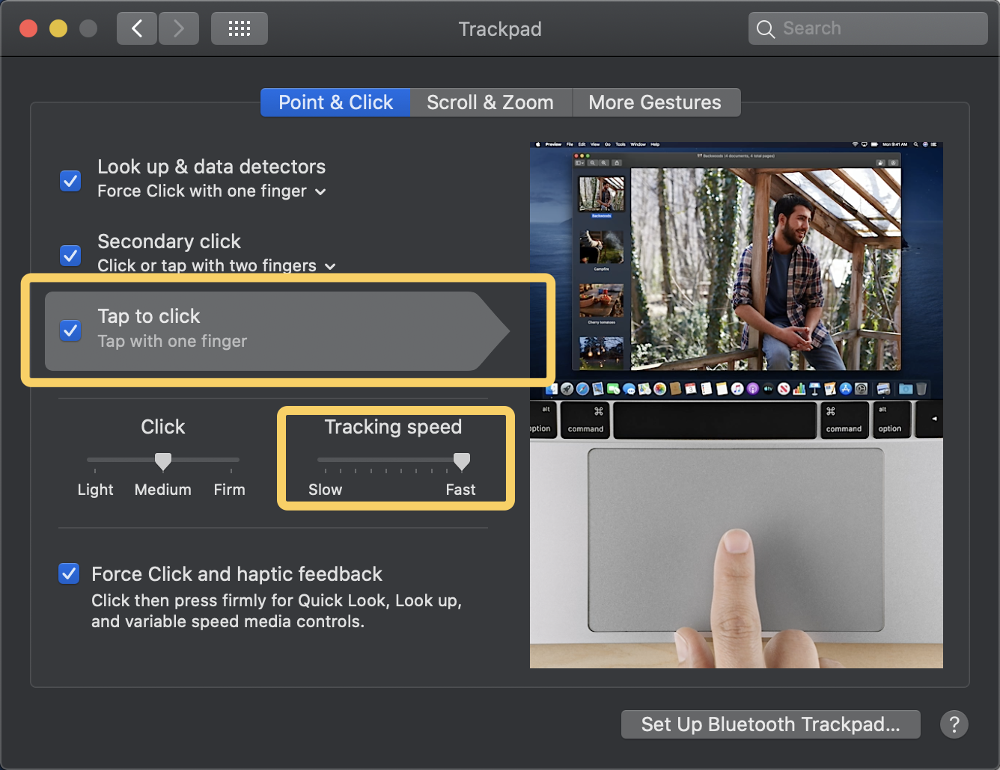
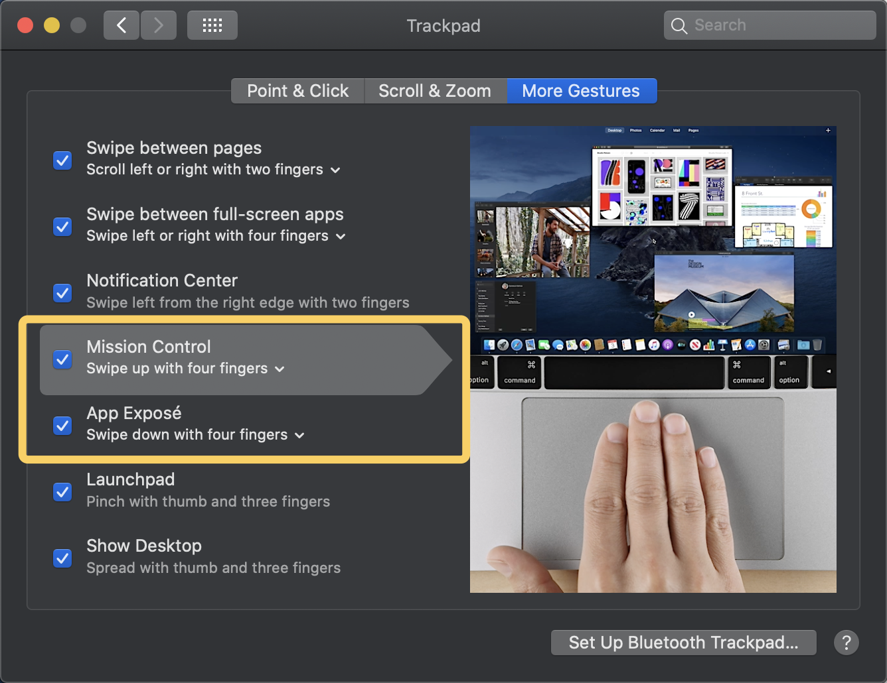
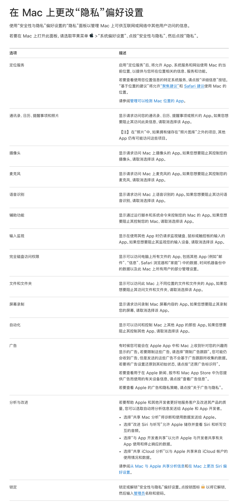

相信大家看完上篇文章的介绍之后，对 `Mac` 有了一定的了解。如果你还没有看，可以花几分钟看一下：[《我为什么不买Mac》](https://mp.weixin.qq.com/s/7dIwXIKO9YuNb1YPs57P7g)。你没有看错，标题就是这个样子的。如果你在了解 `Mac` 的话，强烈推荐看一下。

后续的几篇文章我会介绍 `Mac` 的使用技巧和一些效率软件，欢迎关注噢 ^_^

本文会介绍 `macOS` 的初始化配置，和一些基础的使用：无论你经常使用`macOS`，或者是刚购买 `Mac` 的小白，都可以在这里看到一些有用的东西。除了一些特殊的硬件（`MacBook` 的触摸板、`Touch Bar`等）支持，理论上这篇文章对所有装有 `macOS` 的苹果电脑都适用，所以不管你是用的 `Mac mini` 、`MacBook`系列，或者是 `iMac`、`Mac Pro`系列都适用，希望对你能有所帮助。

如果你是小白，请按照顺序阅读，在你对 `macOS` 有个整体的了解之后，会很快有个使用的提升；

如果你是老司机，可以直接跳到[几个有用的设置](#几个有用的设置)，然后往后阅读，查看高级用法；也可以顺序阅读，看看有没有之前没有注意到的细节。

# 几个按键介绍

先介绍一下 `Mac` 下键盘和 `Windows` 不一样的地方，这样后面在介绍的时候就不陌生了（格式：键盘/英文）：

1. ⌫/Delete：用于删除字符，类似于 `Windows` 下的退格键
2. ⌘/command：空格左右两边的键，类似于 `Windows` 的 `Ctrl` 键 ，例如：复制(⌘+S)、粘贴(⌘+V)都是这个键加相应的字母。这个是使用最多的修饰符，很多快捷键都是这个键
3. ⌃/control(Windows 里面的 ctrl)：另外一个修饰按键，就是其他快捷键会用到它了
4. ⌥/option(Windows 里面的 alt)：又一个修饰按键，输入符号的时候用的多。也用在一些神奇的地方（后面介绍）
5. ⇧/shift：和 `Windows` 一样，输入键盘上面的字符按着它呀
6. fn：键盘左下角的按键，这个主要是为了切换 F1、F2 等按键的效果的

你会发现和 `Windows` 相比，**大部分使用场景就是 `⌃` 换成 `macOS` 下的 `⌘`**。

# 系统介绍

这里介绍一些系统基本的概念和配置。由于用了好几年的 `Mac` 了，苹果的系统可能由于*政策要求*都翻译成了中文，而我看着不太习惯，所以就干脆把系统切换成了英文。下面在介绍的时候我会**双语教学**，图都是配的英文的，使用业界公认的中文进行介绍。遇到**软件、菜单、设置**等，既会说明英文，也会说明中文，希望大家看起来更简单

## 系统概览

你打开你的电脑，按照苹果提示的步骤一步步的完成操作后，进入电脑大致是这样一个页面：
由于我已经使用过了，也打开了一些软件，可能有些不一样。不过别慌，我会一步步的介绍。

图片最上面的一行是 `菜单栏`，左边是应用菜单：你打开应用的所有菜单选项都可以在上面找到；右边是状态菜单：输入法、日历等一些系统或者第三方菜单栏应用会出现在这里；

最下面是 `Dock/程序坞`，可以存放经常使用的 `App`，也会显示目前打开的程序；

中间的一整块壁纸就是桌面了，可以在这里放东西，安装软件的 `DMG` 格式的文件打开后默认也会显示在桌面

### 应用菜单

比方说我现在打开的是 `Finder/访达`，左边的应用菜单依次是：

1. 苹果标志：这个是系统菜单，无论你打开什么应用都会一直在这里，点击的时候出现一些系统的`偏好设置`或者`关机`、`重启`等命令
2. Finder/访达：现在激活的应用名称，点击后出现应用的`偏好设置`或者`关于`等信息
3. 其他菜单：根据当前打开的应用会有所不同，基本上所有的菜单都能在这里找到

### 状态栏

上面是状态栏的各种图标，这里的图标除了最右边的`今天和通知中心`的按钮，其他按钮都可以移动和移除的，方法如下：

1. **按住 `⌘` + 鼠标左键/触摸板按下去**左右拖动，就能改变状态栏的位置
2. **按住 `⌘` + 鼠标左键/触摸板按下去**拖到桌面，就能把一些系统的图标隐藏掉，其实质是在系统的`偏好设置`里面把相应的状态在状态栏移除了

### 程序坞

就是存放经常使用的 `App` 和现在打开的 `App` 的，建议把 `Finder/访达` 和 `Launchpad/启动台`留在上面，其他的可以按需添加和删除。

`Finder/访达` 用于快速打开文件夹，`Launchpad/启动台` 用于快速打开所有程序页面。

在这里还有新建窗口和退出程序的菜单，右键点击就能看到：

如果想要这种点击的图标放大的效果，可以打开`系统偏好设置-程序坞`（也可以在 `Dock/程序坞` 的空白处点击右键打开`Dock Preferences/程序坞偏好设置`），把放大勾选上，还有其他的一些设置，你可以按需求设置。

另外，把鼠标放在 `Dock/程序坞` 上面的分割线上面，可以看到鼠标变成了上下箭头（↕️）的形状，这时候可以调整大小哦～

# 安装和删除程序

刚开始使用，当然是安装和删除应用程序了。这一系列的文章，后面会介绍如果找到和快速安装官网提供的程序，这里就先按照一般方法介绍。

## 安装程序

### App Store 安装

还记得菜单栏最左边那个  嘛？点它，然后点 `App Store`；或者在 `Launchpad/启动台` 里面找到 `App Store`应用打开，也可以；还有一种方式，打开 `Finder/访达`，然后在左边点击 `Applications/应用程序`找到 `App Store`双击。这三种方法都可以打开 `App Store`。

 然后登录你的 `Apple ID` ，搜索想要的应用下载就行了，例如搜索 `Office` 并点进去，点 `GET/获取` 就可以了，如果是收费的，这个获取按钮会变成价格。

### 网页下载的程序安装

比方说 QQ，可以在 `App Store`搜到，也可以在 QQ 的官网搜到。

一般下载的应用都是 `DMG` 后缀的格式，这个是 `Mac` 下标准程序的安装格式，打开之后一般都是一个 `App` 图标，拖动到应用程序文件夹就好了（安装程序窗口会有程序文件夹）:

安装程序是不是很简单，没有各种提示：是否安装 XXX 管家，是否安装 XXX 杀毒；所以也不用小心翼翼的了

## 删除程序

安装的程序都可以直接拖到废纸篓删掉，还记得打开 `App Store` 的第三种方式嘛，直接点击 `Finder/访达` 打开一个窗口，然后点击左边的  `Applications/应用程序` ，就可以看到所有的应用了，这时候你可以选中需要删除的应用，点击右键 `移到废纸篓`就可以了，也可以直接拖动到废纸篓，效果是一样的。

如果是 `App Store` 下载的程序，可以打开 `Launchpad/启动台`，然后按下 `⌥` 键，就可以看到应用都在抖动。

这时候 `App Store` 下载的程序左上角会有叉，点它就可以删除了，如下图 QQ：

你可能会问了：为什么都在抖动呢？因为他们都害怕被删除啊。

这时候你又要问了：为什么系统的不能删除的应用也在抖动？Emm……，他们是在得瑟。

# 几个有用的设置

介绍几个容易被忽略的、设置好之后能提高效率的几个设置项（这里只是简单的介绍，我后面会写一篇详细的效率设置和使用文章）。

## 键盘设置

这里的键盘设置是：打开系统偏好设置（通过 App 打开或者点击左上角  标志打开`系统偏好设置`都一样）-键盘，打开之后有以下几个标签：

### Keyboard/键盘

可以设置键盘灯和功能区（F1、F2等功能键）按键的功能，默认是调节亮度和声音等选项，可以换成标准的 Fx 按键，而不需要按 fn + 相应的内容。

另外如果你用的是带 `Touch Bar` 的 `MacBook Pro`，可以在这里定义相应的按键

### Text/文本替换：

在这里你可以存储一些快捷短语，比方说你经常输入手机号，可以定义一个**Replace/输入码**，输入之后来替换成想要出现的短语**With/短语**：

比如说我把电脑的几个符号设置成了 `dn`，我输入这两个字母的时候会提示我这几个符号：

细心的同学在我菜单栏的图标里已经发现了：我使用的是双拼，所以 dn 这两个字母本来是**电脑**的首字母，现在出来的是双拼的结果，大家不要惊讶为什么截图这么 *dn* 就行。

### Shortcuts/快捷键

这里面可以查看系统的快捷键，比方说截屏、切换输入法，当然也可以在这里设置应用的快捷键。比方说我设置了一个缩放窗口的快捷键：

这个快捷键是让窗口在屏幕最大和原来的尺寸之间进行变化，这个菜单一般在应用菜单的："Window/窗口" 下面

注意：这个快捷键的名称要和 `App` 菜单栏的文本完全对应，所以我设置了两个：英文下的和中文下的，中文的**缩放**是我刚添加的。

如果只有一种语言（英文）的话，可以只设置一个。但是如果你使用的是中文，很多软件不支持中文，这时候就需要两个了。（这也是我喜欢使用英文的一个原因）

这里面是所有系统设置快捷键的位置，可以翻翻看有没有自己需要的：比方说截图。

## MacBook 触控板设置

如果你使用的是 `MacBook` 系列，或者使用的触控板，一定要看一下这里的设置

### Point & Click/光标与点按

这里把 `Tap to click/轻点来点按` 这个勾选上。这个的作用是在你使用触控板的时候，只要单指轻触触控板就可以有点击的效果，而不用用力按下去

另外可以把 `Tracking speed/跟踪速度` 设置到你所能承受的尽可能大，这样才能发挥触控板的威力😄

### More Gestures/更多手势

这里把 **Mission Control/调度中心** 勾选上，并且点击下面的箭头，选择**四指向上轻扫**的手势。

调度中心的作用是查看当前屏幕打开的 `App`，在多个 `App` 切换的时候很有用。

另外 **App Exposé** 这个也勾选上，并且也在下面的选项上勾选**四指向下轻扫**。

这个的作用是查看当前 `App` 的所有窗口。注意：我没有说当前屏幕。

 **App Exposé** 这个苹果可能也不知道怎么翻译了，所以它就叫这个。这也是我用英文的也个理由吧。

**其他在触控板设置里面的的所有手势，都需要看一下，这就是很多人不需要鼠标的秘密**

### Accessibility/辅助功能

辅助功能在`系统偏好设置-辅助功能`，里面因为这里有一个很重要的触控板的设置，之前在触控板里面，后来被移到了**辅助功能**里面，所以我仍在触控板里面说一下。

打开之后左边选择 `Pointer Control/指针控制`，然后点击右边的 `Trackpad Options/触控板选项..`，把打开的小窗口 `Enable dragging/启用拖移`勾选上，并且选择`three finger drap/三指拖移`。

这个效果是三个指头在触控板上，可以选择文字和拖动窗口，相当于按下去移动（鼠标左键按下去拖动）。因为这个原因，所以在上面**更多手势**里面把两个东西设置成了四指。

# 其他小技巧

## fn 键的使用

上面介绍过，键盘最上面的一排 F1、F2 等是功能键，提供一些常用的功能。

默认情况下是调节键盘灯、屏幕亮度、声音什么的功能按键；也可以改成标准的 Fx（F1-F12） 的作用，比方说在编程界 `JetBrains` 很多软件的快捷键都是用 Fx 的。

默认的功能键下，如果想使用 Fx 键，这时候按着键盘左下角的 `fn` 按钮，再按相应的按键，就是对应的 Fx 的按键的作用了。

我想说的是：

这个键有一个好用的功能，就是：按下 `fn` 键的同时，再按 `⌫` 删除，会发现删除了光标后面的字符（默认是删除前面的字符），这个类似于 `Windows` 的 `Delete` 的作用；而直接按删除，和`Windows` 的退格键（backspace）一样的作用。

## Catalina 应用权限

因为 `macOS Catalina` 增加了隐私性，所以在访问位置、通讯录等信息，甚至是访问桌面等文件夹和照片的时候，都需要用户授权。所以：

如果你在使用**屏幕截图**、**录音**、**录屏**的时候，发现只有桌面背景，没有了窗口内容，那么就是没有权限了。

设置权限、查看某个权限都有什么应用在使用，可以在 Mac 上，选取苹果菜单  >“系统偏好设置”，点按“安全性与隐私”，然后点按“隐私”。

因为这几个权限用的比较多，所以单独说一下。

下面看一下官方给出的所有权限的说明：

## ⌥/option 的使用

### 删除应用

在前面介绍的`Launchpad/启动台`里面，按 `⌥` 键可以删除 `App Store` 下载的应用，这个说过了

### 特殊符号

首先使用组合键可以输入特殊符号，比方说苹果标志：，这个图标使用的快捷键是：`⌥+⇧+K`，还有很多其他的符号。如果你很无聊，可以试试都是什么符号。

还有一种输入符号的方式是打开所有符号表：点按菜单栏中的输入法菜单，然后选取“显示文字表情与符号”，默认快捷键：`⌘+⌃+空格`，可以找到你想要的所有表情和符号。

### 常用操作

前面说到 `⌥` 会用到一些神奇的地方，在操作的时候配合使用能出现意想不到的效果。

* **菜单栏查看更多信息**：正常点击状态栏的 `Wi-Fi`可以切换或者进入设置，如果按下 `⌥` 再点击，发现可以看到 IP、路由等信息
* **快速勿扰**：点击菜单栏的 `今天和通知中心`图标的同时，按住 `⌥ `，你会发现这个图标变灰了：这是打开了`勿扰模式`，这样所有的通知都不弹横幅了。如果没有这个快捷操作，需要点开`今天和通知中心`，然后在`今天`的最顶上打开和关闭勿扰模式
* **强制退出**：还记得在 `Dock` 里面右键应用可以退出程序嘛？如果程序无响应或者需要强制退出了，可以按着 `⌥`再点击右键，就可以看到**退出**变成了**强制退出**
* **进入设置**：正常情况下按 F1、F2等调整亮度或者声音什么的，如果你按下 `⌥` 再去按这些操作，发现会打开相应的偏好设置，可以快速进入相应的设置。比方说在按着 `⌥` 的时候，再按 F10、F11 或 F12 这三个按键的任意一个（带 `Touch Bar` 的可以按声音图标），都可以跳转到声音的偏好设置。

## QuickLook-空格的使用

在 `macOS` 上，选中文件之后，按空格键，能预览大部分的文件：文本、视频、音频等。

也可以定义我们自己需要查看的文件类型。这篇文章太长了，就不放了，后面我会专门写一期这个怎么使用。

# 个人使用习惯

## 个人文件夹

我在电脑里存放文件的习惯是：

1. 在用户目录下新建自己的文件夹，所有的文件都放到这个里面
2. 设置权限，其他人不能访问
3. 创建桌面快捷方式，可以把自己文件夹快捷方式放到桌面，还可以把经常用的放到这里。（拖动文件到桌面，并且按着`⌘+⌥` 两个按键创建快捷方式）
4. 临时存放的东西可以放到桌面，到时候直接删除（这样可以保持桌面的清洁）
5. 可以把下载文件夹当作临时文件夹，也可以在自己的文件夹里面添加临时文件夹，临时下载或者使用的文件放到里面，定时清理

这个只是我的使用习惯，相信你在使用一段时间之后，有自己的一套习惯。

## Dock/程序坞设置

`Dock` 我一般放的比较小，而且是在底部自动隐藏的。

有些人喜欢放左边。由于我外接了显示器在左边，会影响 `Dock` 的出来，所以我放到了下面。

另外：我的 `Dock` 放了在工作的时候基本上都是打开的 `App`（被你发现了，我是一个码农），反正他们都要占用地方的，就一直让他在这儿；经常不用的就让他藏在 `Launchpad/启动台` 里面吧。

# 最后

这篇文章介绍了 `macOS` 一些初始化设置，还有提高效率的配置，这只是系列文章的第二篇（如果[《我为什么不买Mac》](https://mp.weixin.qq.com/s/7dIwXIKO9YuNb1YPs57P7g)也算一篇的话）。

我会在后面继续更新包括但不限于以下内容：

* `Mac` 的使用技巧和效率工具
* `Mac` 上的各种软件
* `Mac` 和 `iPhone`怎么配合使用

希望关注我的公众号，大家一起学习：

