前面两篇文章介绍了 `Mac` 的优势和特点，后面的文章会介绍一些 `Mac` 常用的软件和技巧，欢迎大家关注。

今天呢，就先介绍一下 `Mac` 自带`聚焦搜索(Spotlight)`的功能，为大家成吨的提高效率铺平道路。

当然，如果大家有什么想要了解的，可以在评论里面提出来，我会尽量满足大家的需求的。

如果你想看 `Alfred`的使用，不要慌，后面讲第三方软件的时候肯定能讲到。

好了，进入正题：

## 启动

使用`聚焦搜索（Spotlight）`，可以快速在 `Mac` 中找到想要的文件，或者打开应用程序。

启动方式有两种，一种是在菜单栏中点击放大镜图标；另一种方式是使用默认的快捷键 `⌘ + 空格`。

打开之后是下面的样子，只要输入打开的程序，或者想要查找的内容就好了：

## 打开应用

直接输入要打开的应用名称，按 `Enter ` 就可以了。

## 查找文件

如果想要查找文件，直接在输入框里面输入想要的文件名：

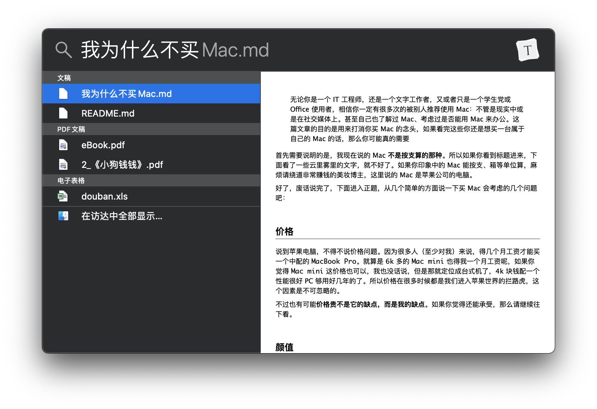

如果你输入的名称比较精准，第一个就是你想要的，那么你可以直接按 `Enter` 打开；

如果第一个不是你想要的，你可以按上下键选择，然后按 `Enter` 打开；

如果你想在访达中显示所有的结果，看到那个**在访达中全部显示...**了吗？点它就行了；

如果你只是想打开文件所在的文件夹，比方说想改名称或者只是看看，你可以按 `⌘ + Enter` 就打开了所在的文件夹，并且默认选中了当前文件。

你可能已经发现了，查找文件的时候，**不仅可以匹配文件名，也可以匹配文件内容**。

## 计算器

你还可以在聚焦搜索里面直接调用计算器进行计算：

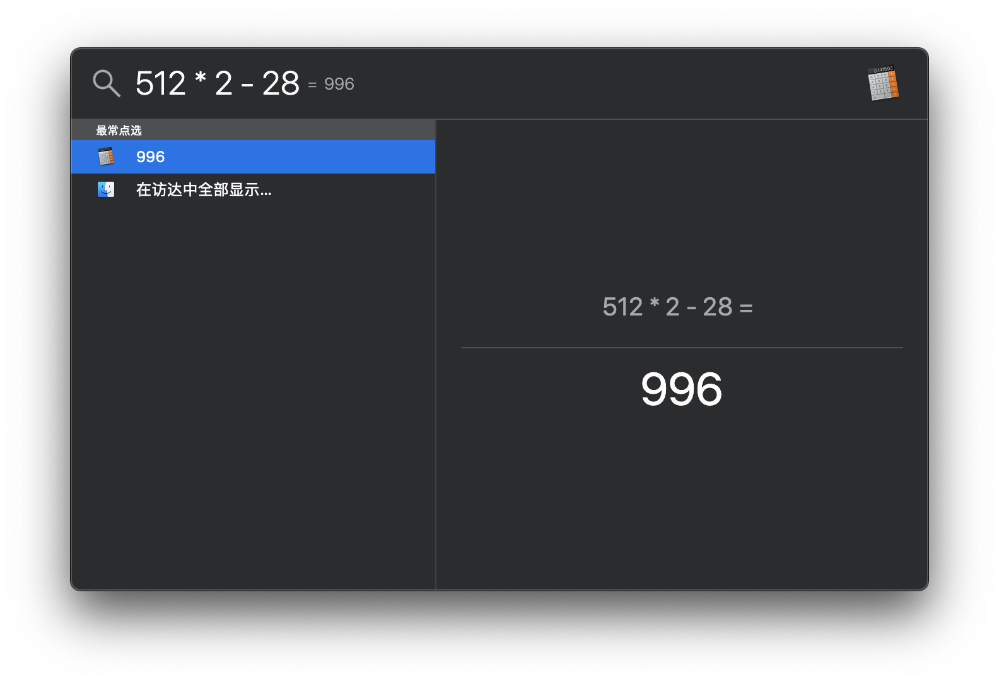

## 单位换算

聚焦搜索还可以进行单位换算：

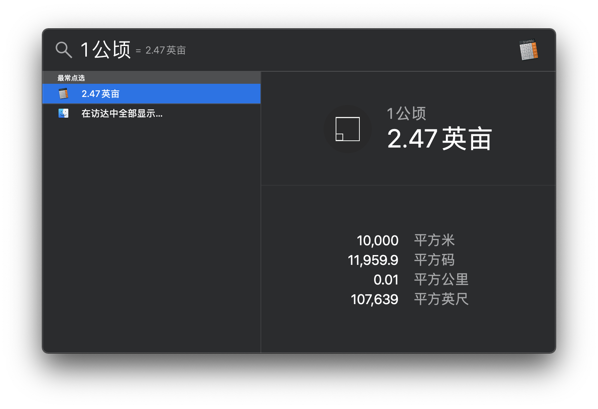

## 查找某个类型的文件

输入`种类：`或者 `kind:`（注意有冒号，冒号不区分全角半角），然后输入想要的文件类型，就可以查到对应类型的文件了：

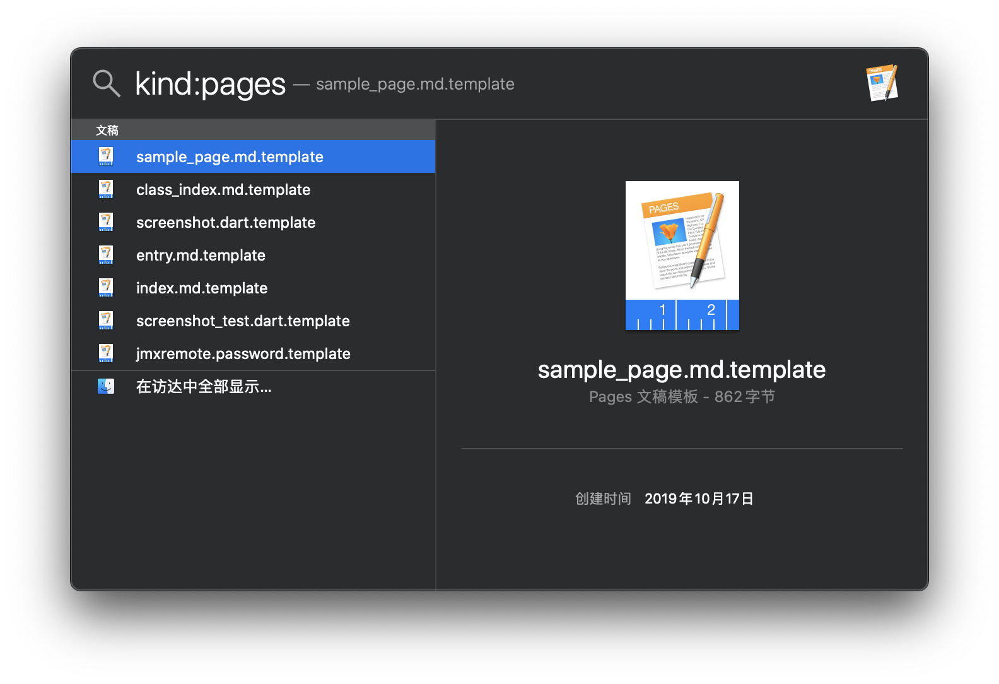

如果想要查找某个名称的指定类型文件，可以用这样的格式`kind：类型（文件名）`：

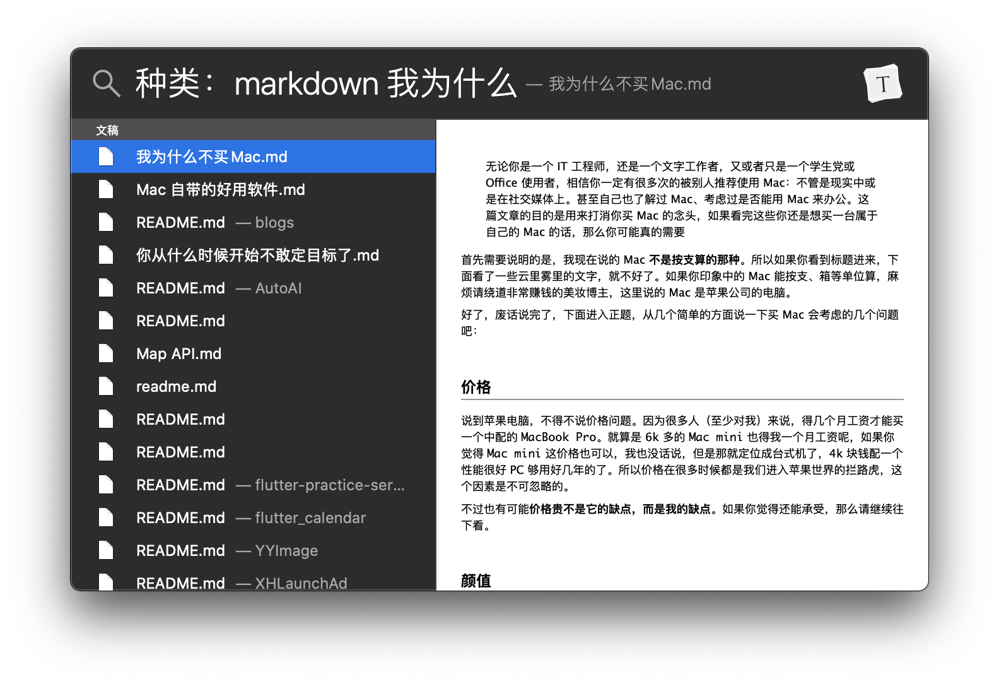

## 获取定义

如果你想查询某个名词的含义，或者英文单词的中文意思，当然也可以在里面输入了：

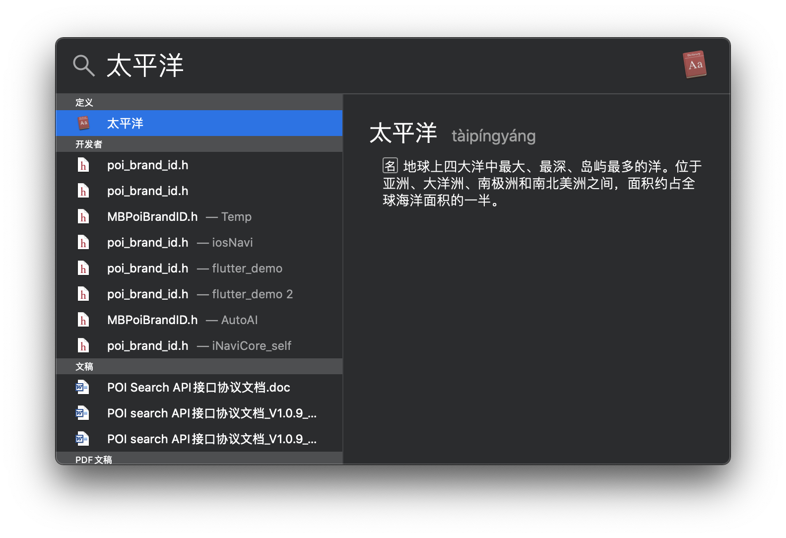

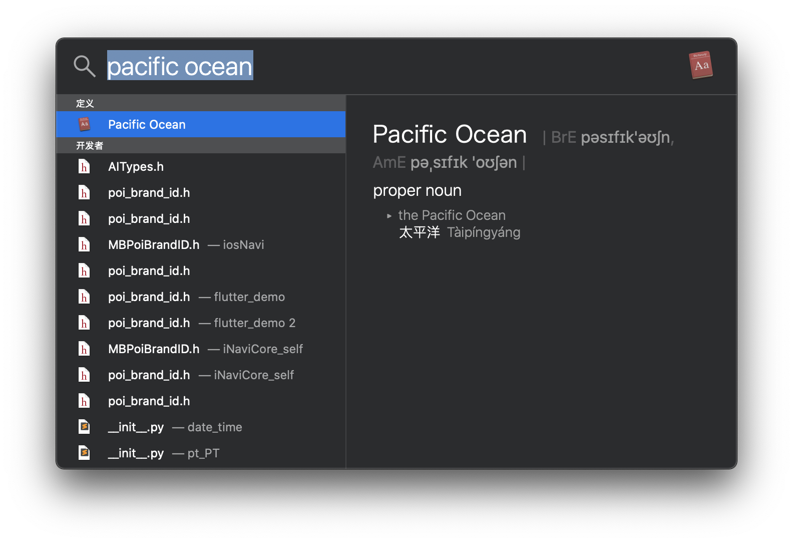

##  查找联系人

如果你使用 `Mac` 存储了联系人；或者你的 `Mac` 和 `iPhone`  登录了同一个 `Apple ID`，并且使用 `iCloud` 同步了联系人，你可以使用聚焦搜索搜到：

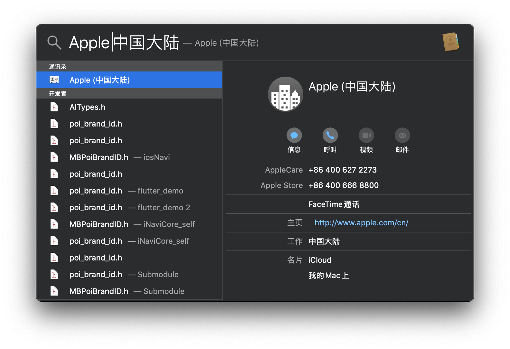

当然也可以发送短信、打电话，这里需要 `Handoff（接力）`来使用 `iPhone` 打电话或者发短信。（接力我们在后续的文章中介绍）

如果是 `iMessage` 的话，直接能发送。

## 播放音乐

如果你的 `音乐` 应用里面有存本地音乐，可以直接搜到，并且按 `Enter` 打开`音乐` 应用播放：

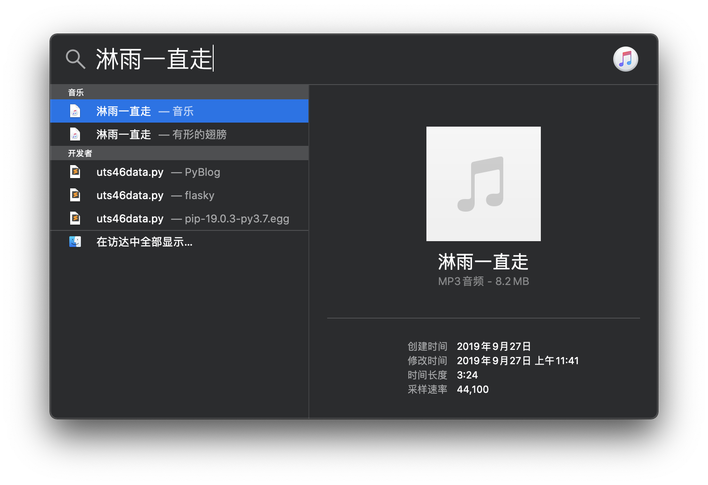

## 搜索 Safari 的书签或历史

如果你经常使用的浏览器是 `Safari浏览器`，你也可以通过聚焦搜索来搜到你之前访问的历史，或者已经存的书签：

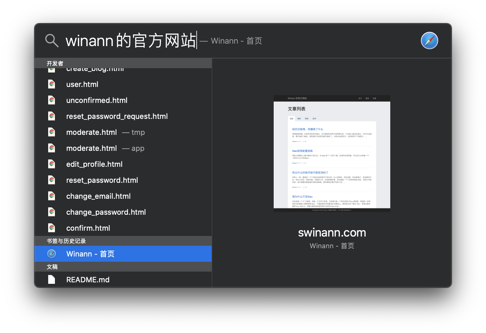

## 系统设置

如果你想直接打开系统的设置，除了输入`系统偏好设置`打开之外，你还可以直接打开对应的功能设置：

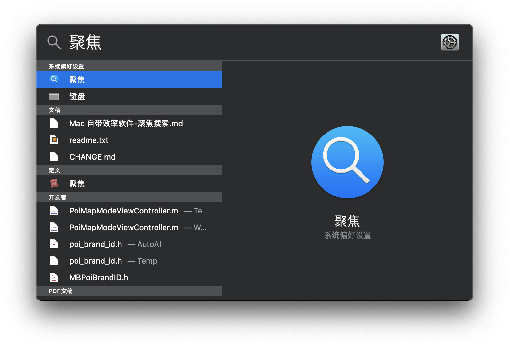

这时候直接按 `Enter`，就会进入聚焦搜索的设置页面：

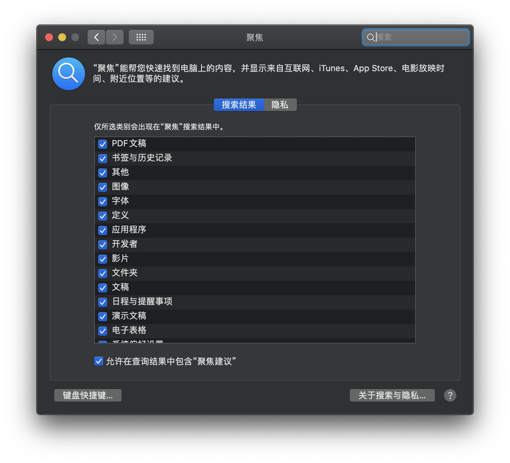

在这里，你可以设置想要的结果，不想要的结果（去掉勾选）；还可以在隐私里面设置不想被搜索到的文件夹（比方说你藏得小电影啊，各种照片的文件夹）。

可以根据自己的喜好，来配置你需要搜索的结果。

## 最后

Emm……我本来是想用一篇文章，把整个 `Mac` 自带的软件功能讲完的，这样后面就能将第三方软件了。

可是我在写的时候，越写越多，总觉得有些东西没有讲清楚。

如果我真写一篇文章里面，不仅我写的时候容易出错，你看着更累。

所以这是系统软件的第一篇，也就是说后续还有 `N` 篇。

还是那句，觉得写的不错的话，欢迎关注我的技术公众号：

