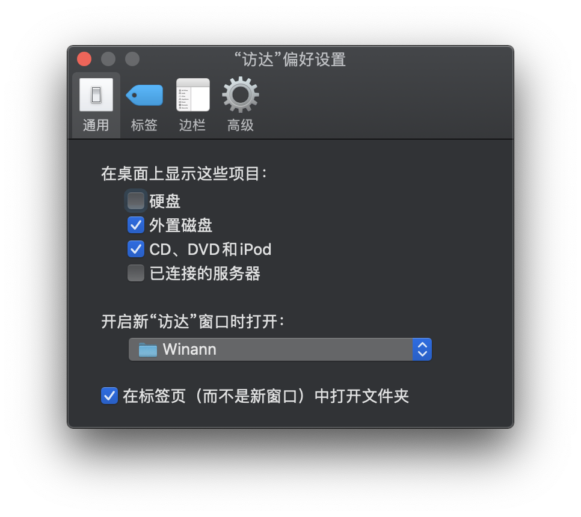
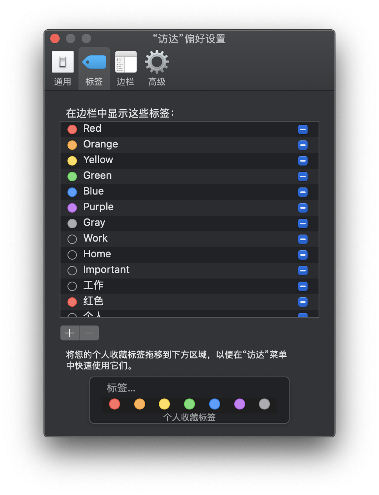
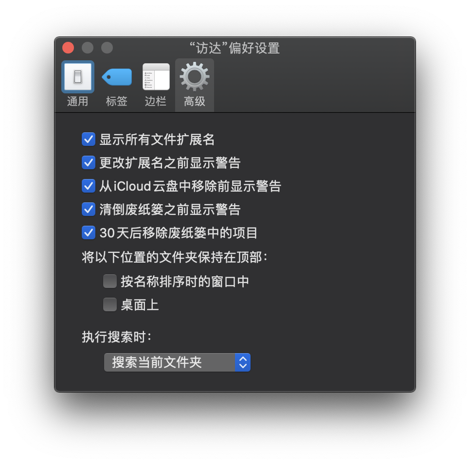
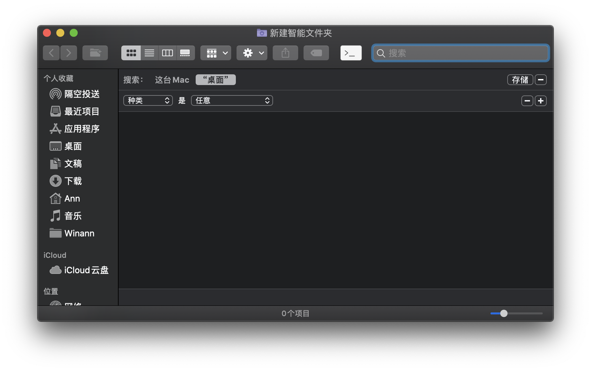
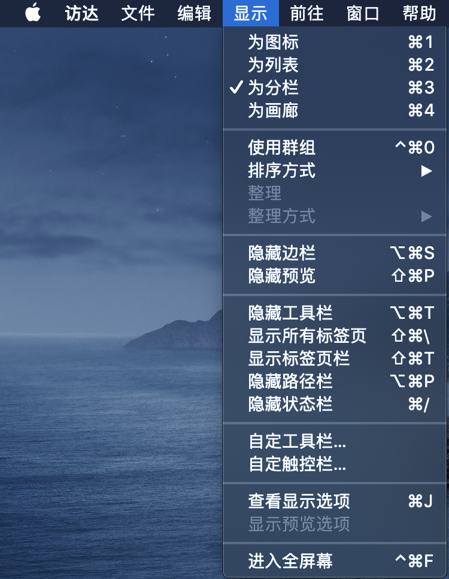
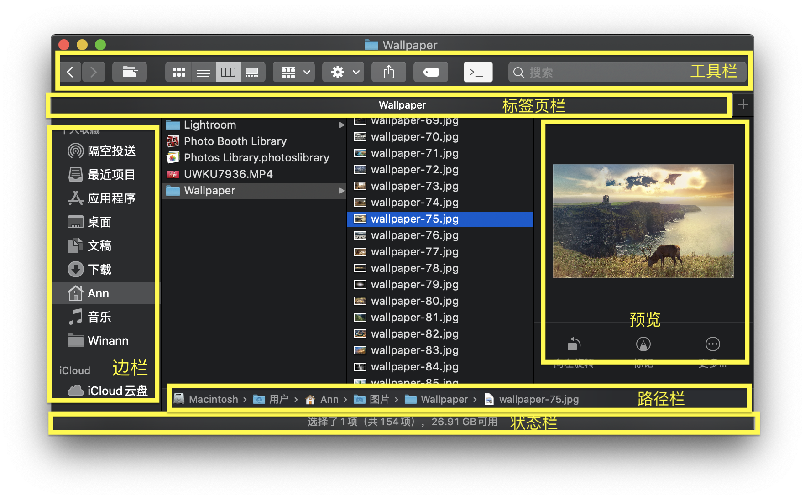
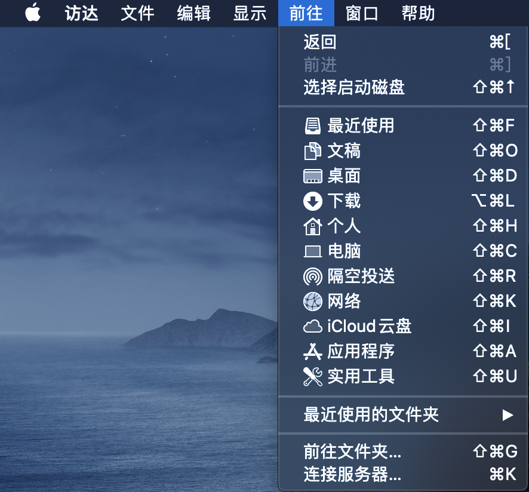
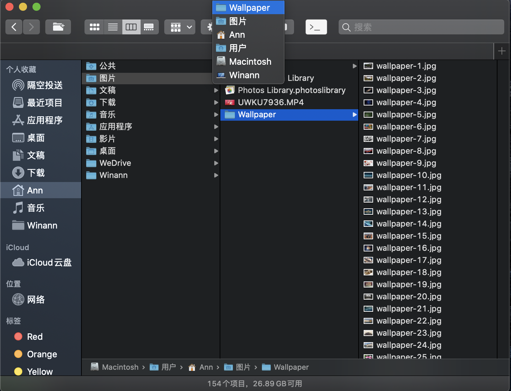

`Finder`，中文名`访达`，应该是 `Mac` 中使用最多的程序了。无论是管理文件、文件夹、应用程序和磁盘，还是快速预览和查找文件，都可以使用 `Finder` 来操作。

可是对于这么一个需要频繁使用的软件，你真的会用了吗？没关系，这篇文章就是带你丝滑的使用 `Finder` 的，躺好了准备起飞吧。

防止有人没有看以前的文章，把按键对应的符号介绍放这里：

- Command（或 cmd）：⌘
- Shift ：⇧

- Option（或 Alt）：⌥
- Control（或 ctrl）：⌃

## 偏好设置

首先我们看一下 `Finder` 几个有用的设置，当打开一个 `Finder` 窗口，或者处于激活状态的时候，可以点击菜单栏的*访达-偏好设置*，或者使用快捷键：`⌘+,`，来打开访达的偏好设置

### Finder 默认打开自定义目录

在第一个标签—通用—里面的 *开启新“访达”窗口时打开：*菜单下面，可以选择自己经常使用的文件夹，比方说我所有的东西都在我自己的文件夹下面，所以可以选择自己的文件夹

### 在标签页中打开

在通用设置里面，你还看到了一个*在标签页（而不是新窗口）中打开文件夹*的选择框，不要被他的名称蒙蔽了。这个在标签页打开文件夹的适用场景有两个：1. 按住 `⌘`键然后点击打开；2. 在 `Finder` 窗口中右键通过菜单打开。

如果你想设置正常情况（我们双击文件夹或者使用 `⌘+O`打开文件夹）使用标签页，需要在*系统偏好设置-程序坞-打开文稿时首选标签页*设置，这个默认是在全屏的时候打开标签页，你也可以选择永远使用标签页打开，或者自己手动打开。

标签页就和浏览器的标签差不多的概念了。

### 使用标签

在 `Finder` 偏好设置的第二个标签是*标签*设置，是不是感觉这句话挺绕啊，绕不要紧，因为我是故意这样说的，你还可以看上面的图啊。

这个标签可以给文件或者文件夹打上标签。你可能会问了，标签有什么用呢？

这个问题问得好，这样就可以快速根据分类来找到自己想要的软件了——就相当于一类东西贴上了同一种标签。如果使用得当的话会提高找文件或者文件夹的效率哦。

### 设置边栏

边栏，就是默认在 `Finder` 左边的，可以快速打开的一些功能或者文件夹。自己按需添加就行了，我就不贴图了。

### 在当前文件夹搜索

如上图所示，一般你在某个文件夹点击搜索时，是希望搜索当前文件夹，而不是整个 Mac，可以通过这里来配置你想要的范围。

* 显示所有文件扩展名：就是显示后缀，建议选中
* 更改扩展名之前显示警告：如果你手误，把 `me.jpg` 改成 `me.jp`或者其他的后缀，系统询问你是否真要这样更改。因为系统是根据后缀来认文件类型的

其他的按照字面意思理解就行了。

## 菜单介绍

如果你看完上面的偏好设置，以为就完了吗？大错特错了！我们还有看菜单栏呀～

### 智能文件夹

智能文件夹不是一个真正的文件夹，相当于一个筛选条件，当你创建好之后，里面的文件会随时更新，保持符合条件的最新状态。

如上图所示，你可以添加查找条件，条件右边的 `-` 可以删除当前条件，`+` 可以添加更多的条件，智能文件夹可以使用以下方法创建：

* 点击菜单中的文件-新建智能文件夹，然后输入条件，点击存储
* 在需要创建的文件夹，点击搜索，输入搜索内容并按 `Enter`按键（或者使用搜索快捷键 `⌘+F`），可以看到和上面使用菜单创建的类似

如上所说，智能文件夹并不是一个真正的文件夹，你可以把自己想要的检索条件添加进去，以后新建文件如果符合条件，会自动更新到这个智能文件夹。

当然，如果你把智能文件夹删了，也不会影响文件夹里面的原来的文件，你可以把这里当作一个索引。

### 显示

第一组为文件夹内容的显示方式，**为图标**方式在显示预览的情况下查找图片会比较方便一点；**为列表**在按照名称查看时候比方方便；**为分栏**在多层文件夹之间查看比较方便；**为画廊** 查看照片的时候会有很大的优势。你可以试一下，看一下自己需要什么样的方式来查看。

第二组整理，如果在桌面的菜单，**使用群组**会变为**使用叠放**。在桌面**使用叠放**，就是把相同类型的文件放到一起，点击的时候再展开，这个功能有利于不整理桌面、找不到东西的同学；**使用群组**的功能就是把文件夹的内容，按照类型分组。

第三组和第四组的相关区域介绍如下：

工具栏可以自定义，例如我把新建文件夹的图标放到了前进后退的右边，可以方便创建文件夹。

### 前往

在前往菜单，可以快速返回和前进，也可以查看上层文件夹，这几个快捷键可以记一下。

第二组表示系统的文件夹，或工具，点击之后可以打开相应的功能。

最后一组，**前往文件夹**（快捷键`⌘ +⇧+G`），可以输入路径，打开存在的文件，`~`表示用户文件夹（`~/Desktop`就表示当前用户下的桌面）。**连接服务器**，可以远程控制其他 `Mac`，格式`vnc://192.168.0.1`，注意 IP 换成需要远程 `Mac` 的 IP 地址，也可以连接 ftp 等服务器。

## 各种技巧

### 路径栏

还记得一个文件夹打开之后的路径栏嘛？你可以右键相应的路径，然后选择*将“xxx”拷贝为路径名称*，就可以拷贝路径了。

你还可以拖动文件或者文件夹，到路径栏中的任意一个路径。

双击路径中的文件夹，就可以打开相应的文件夹哦

### 查看路径前的文件夹

如果你在当前文件夹，想要显示上一个、上上一个、上上上一个……等文件夹的内容，可以使用路径栏，也可以使用*菜单-显示-上层文件夹*（快捷键`⌘+↑`），一个一个向上找到想要的文件夹就行。

还有一种方式，你可以按住 `⌘`或者`⌃`，然后点击 Finder 的标题，这时候就会出现当前路径前的所有文件夹了：

### 显示隐藏文件

如果你想显示隐藏的文件夹，可以使用快捷键：`⌘+ ⇧+.`三个按键，再按下去就是隐藏了。

### 空格键预览

当你想要预览某个文件的时候，你只要按下空格键，就可以预览大部分的图片、视频、文档等。

还可以通过安装支持的插件来预览更多的内容。

具体操作可以搜索 `QuickLook`来安装更多的插件。

### 侧边栏增加目录

你想把你的文件夹也放到 Finder 的侧边栏？

很简单，直接拖到侧边栏就行了！

### 多个文件统一命名

你可能看到我上面放的 Finder 的图中，墙纸路径下的图片都是统一的命名，你可能也有多个文件重新命名的需要。

你只要选中你想要重新命名的文件，然后*右键-给N个项目重新命名*，同样的功能可在*菜单-文件-给N个项目重新命名*中找到。

命名的格式有很多种：

1. 替换文本：就是将原用户名中的全部或者部分字符，替换为新的字符
2. 添加文本：可以在原来的名称前或者后面添加想要的字符
3. 格式：你可以不用管旧的命名，使用提供的*名称+索引/计数/日期*来命名所有选中的文件

## ⌥ option 键在 Finder 中的妙用

### 拷贝路径

默认快捷键：`⌥+⌘+C`。

你同样可以在*菜单-编辑*点开的状态下，按下 `⌥` 按键试试，看看有什么变化。

### 拷贝文件

如果你在鼠标拖动某个文件或者文件夹，到其他文件夹的时候，默认是移动到相应的文件夹。可是你想复制怎么办？

拖动的时候再按下 `⌥`按键喽，是不是有个好看的加号？

### 重启 Finder

如果 Finder 被你玩的卡死了怎么办？

你可以点击左上角*-强制退出*，然后找到 Finder，点击**重新开启**就行了，如果是其他 App，则是**强制退出**。

你还可以在 Dock 中，按下`⌥`，然后右键点击 Finder，可以看到重新开启。聪明的你一定想到了，如果是其他应用，则是强制退出。没错，就是这样的！

### 查看多个文件的简介

如果你想查看某几个文件或者文件夹的简介的时候，你可以*选中相应的文件夹-右键-显示简介*，这样可以分别查看文件或者文件夹的信息。

但是如果你想查看多个文件夹或者文件占用的空间怎么办？试试在右键点击的时候按下 `⌥` 键喽。你会发现**显示简介**变成了**显示检查器**，这时候点击就是所有选中文件或者文件夹的整体情况了。

### 显示资源库文件夹

**资源库**文件夹，是用来储存配置文件、缓存和用户数据的目录（路径：\~/Library/），你可以看出来这个文件夹比较重要，所以 Finder 默认是隐藏的。那么如何显示呢？

在*菜单-前往*中，你可以前往文件夹，这里默认是没有资源库的，这时候按下 `⌥`，神奇的事情又发生了。资源库文件夹出来了。

但是你可能会想了，他那么重要，我需要经常访问，没有其他更便捷的方法了嘛？当然有了：

在你的**用户目录下**，右键选择查看显示选项，或者在*菜单-显示-查看显示选项*（快捷键`⌘+J`）可以打开，不要犹豫，把**显示“资源库”文件夹**勾上吧！

## 其他快捷键

除了上面介绍的能找到的快捷键，还有一些简单的快捷键：

`enter`/回车：重命名

`⌘+↓`或者 `⌘+O`：打开文件或者文件夹

`⌘+Z`：撤销拷贝、移动或者删除等文件夹内的操作

`⌘+I`：显示简介（请练习：配合 ⌥ 的妙用，使用快捷键预览多个文件）

## 最后

相信介绍完上面的功能之后，你一定有自己的偏好和使用习惯，马上设置和使用起来吧！