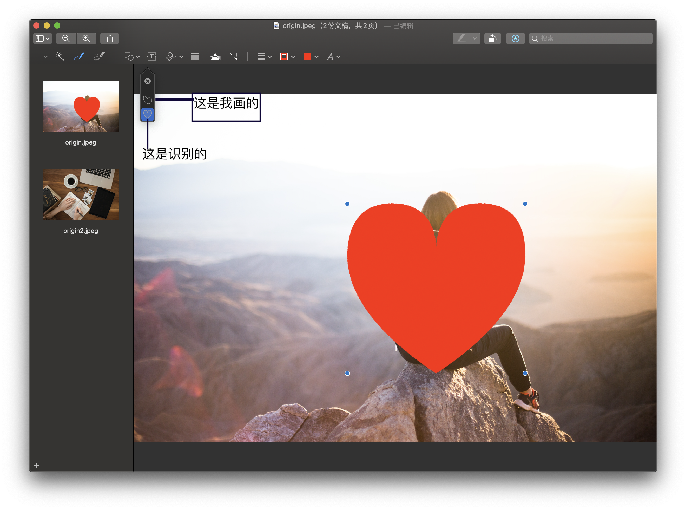

说明一下，给第一次看到我文章的看官：

你看到的这篇文章，只是介绍 `Mac` 使用技巧的一系列文章中的一篇，前面有几篇（如果你没有看过，欢迎翻阅），后续还会有很多文章，旨在帮助你打造高效率的 `Mac`。刚开始会以系统的设置和系统自带软件为例进行讲解，后续会介绍第三方软件和更多的使用技巧。

但是，我准备的技术文章不仅仅是使用 `Mac` 效率，还会介绍到手机等各种身边电子设备的使用技巧。

另外由于我还是一个码农，所以我后面还会写一些编程的东西。

说这么多，其实很简单：*代码滞销，救救孩子吧！*欢迎关注我的公众号：**`Winann`**。

Emm……，是时候进入正题了。

除了前面文章介绍的 `Finder`，相信在使用 `Mac` 的时候，也离不开`预览`这个 App。

作为系统自带的软件，除了看图之外，还可以应付我们大多数时候的简单修图、改图，甚至阅读 PDF、对 PDF 文件进行简单编辑也很方便。

在 `Mac` 中使用预览：移除照片的位置信息，调整色阶、曝光、饱和度，裁剪；为文档和图片添加形状、文字、签名，这些功能你都会了吗？往下看看吧，你一定能发现没见过的东西～

## 预览页面和菜单

当你打开图片的时候，默认是预览 App 打开的，像上面的页面。你可能只打开了一张图片，没有左边的缩略图，也可能进行了一些设置，跟我的不太一样。不过没关系，我会一点点的介绍。

### 菜单介绍

* 文件：可以打开、关闭文件，也可以导出或者另存为，甚至可以从 iPhone 或者其它设备导入。

* 编辑：可以拷贝、粘贴，也可以对正在编辑的图片撤销或者重做等操作。如果一个 PDF 想插入另外的 PDF，可以看看这里的插入。当然，不想要的页可以直接删除哦。

* 显示：标签页在这里，但是我个人觉得在预览里面不怎么用；

  第二组，可以显示侧边栏、缩略图、目录，还有 PDF 独有的书签、重点和备注，我上面的图片就是因为显示了缩略图，所有左边有侧边栏；

  第三组，在 PDF 预览的时候翻页的方式，你可以切换试试；

  第四组，利用描述文件进行软打样菜单，可以在不更改图像或其显示分辨率的情况下，查看该图像在另一台设备（如打印机）上的外观，这个选项对与输出和打印非常有用，可以提前预览打印的效果。显示图像背景，可以在图像是 PNG 等格式的时候，显示有透明度的背景

  第五组，可以缩放图片大小。缩放到所选，可以让你放大选中的部分（选择工具我们后面介绍）。什么？你想把所有打开的图片都进行一样的缩放？那你按下神奇的 `⌥ (option)`按键试试。

  第六组，可以显示/隐藏工具栏（就是我上面图中放大镜的那一行），也可以把自定义工具栏：

  

* 前往：不仅仅是上下翻页呀，在预览 PDF 的时候，*向后*和*前进*可以在你点击的几个页面之间切换；

* 工具：显示检查器可以查看图片或者 PDF 的信息，图片的 Exif 信息也可以在这里看到。

  显示放大器（快捷键：**`**，就是1左边的那个键）：可以出来一个放大镜，查看图片或者 PDF 看不清的细节，比方说美女有几根头发😂；

  调整颜色：可以调整色阶、曝光、对比度等图片的属性；

  调整大小：可以按比例或者自由调整图片的大小，如果不按照比例的话，图片会变形哦；

  注解：这个比较好玩了，可以在 PDF 上面加一些文字高亮、下划线、形状、文本。遮罩，可以在图片或者 PDF 上面加一个矩形框（目前没有发现能使用其他形状），可以突出主题；放大镜，可以在图片或者 PDF 上面放一个放大镜，也可以用作突出主题的作用（如下图所示：矩形隐藏了其他细节突出了咖啡，而圆形的放大镜把图中的眼镜放大了）；

  

  旋转和裁剪：可以旋转图像，也可以裁剪图像，裁剪我们在下面介绍工具的时候介绍；

  指派描述文件：可以指定图像以某种色域或者设备显示。

  显示位置信息：如果你的照片有定位的话，点击这个菜单会打开上面说的检查器-信息-GPS相关页面，并且可以在地图上用大头针显示拍摄图片的位置。如果你注重自己的隐私怎么办？当然是**移除位置信息**喽！如下图所示：

  

## 图像编辑工具栏

如上图所示，标记工具栏就是用于编辑图像的。我们从左边开始讲解

## 选择工具和裁剪

第一个工具，默认是一个矩形，就是矩形选择工具，可以点开，前两个是形状选择工具，第三个套索选择，可以自己画任意的形状。

选择工具就是选中要操作的图片内容，然后进行裁剪或者简单的抠图。

我们试一下**智能套索**：

选择*智能套索*之后，使用红色的画笔选中将要裁剪的图片区域，只要选择边缘就行了。如下图所示，我们选择了妹子，可以看出来整体上还是比较准确的。如果你选择的元素边缘和背景有比较大的反差，那么用这个工具没有错。

第二个工具，像荧光棒一样，叫**立即 Alpha**，顾名思义，就是将一些元素设置为透明的，就相当于抠图了。

我们不用妹子了，因为妹子黑色的衣服和背景有点重叠，我们使用第二张图：

可以看到图里面的 iPad 被立即选中了。

选中了，然后呢？

上面选中之后，都可以进行裁剪，或者把选择的内容删除掉，比方说我们把选择的妹子给裁剪出来了（点击工具栏最右边的裁剪，或者使用快捷键：`⌘+K`），然后把第二张图片的 iPad 删除了（按⌫（backspace）删除按键）。

效果如下，如过把菜单-显示-显示图片背景（快捷键`⌥+⌘+B`）勾选上，就能看到背景在哪里了：

## 使用速写画出想要的图形

第三个工具叫速写，可以很容易猜到是快速生成某个图形的，例如我们把刚才的更改撤销掉，然后在妹子图像上画一个心。

可以看到，虽然我画的不怎么样，但是已经能识别出来形状了，默认就是心，如果你觉得自己画的还不错，可以点击自己画的原始图片：

## 绘制

可以绘制想要的形状和线条，如果有forcetouch 的触控板，可以根据压力的大小，来绘制不同的粗细。

## 快速插入指定的形状和

第一个分割线右边的矩形和圆重叠的图标，右边还有一个下三角，可以插入指定的形状，下面的两个，一个是遮罩，一个是放大镜，我们在讲解菜单的时候讲过。

## 添加文字、签名和备注

画 T 带个框的，就是文字了，点击之后可以添加一个文本框，可以拖动到你想要的地方；添加文字可以在图片上添加，也可以在 PDF 上相当于填写哦～

再往后是签名，注意签名可以使用触控板或者 iPhone 手写，也可以自己签名到一张 A4 只上面，使用摄像头扫描，就不演示了；

备注：在 PDF 里面可以增加备注，用来记笔记或者其他内容。

## 调整颜色

像三棱镜将光折射的图标，可以用来调整这些参数，能调整的参数具体如下（图片是妹子的那张图片，所以整体比较偏亮）：

## 调整图片尺寸

调整图片尺寸和菜单里面效果一致，能设置的参数如下：

## 修改形状的颜色、线条和字体的属性

你可能会说了，前面添加的形状和文字，都不是我想要的效果呀，我怎么改。

看到工具栏最后一组图标了嘛？

前三个都是和绘制的形状有关系，第一个是线条的样式，样式会根据选择的绘制样式改变，分组可以分别选中，可以多试试这几个样式；第二个是图形边框的颜色；第三个是图形填充的颜色。两个颜色都可以透明。

第四个是文字的属性，可以设置字体样式、大小、属性、颜色、对齐方式等。

## 使用预览合并图片

当你想合并两张图片的时候，因为没有买 PS，也不想装乱七八糟的软件，自己的硬盘还那么小，是不是有点发愁？

别慌，我们使用预览来简单合并一下。

还是用刚才两张图片，我们将下面的图片合并到妹子的头上：

1. 选中第一张妹子的图片（`⌘+A`），然后剪切（`⌘+X`），如果你的图片不是 `PNG` 格式的话，会提醒你转化为 `PNG`。剪切完之后，如果你打开了*显示图像背景*选项，看到的就和我的一样了：

   

   

2. 这时候，如果你想调整图片尺寸，可以选择*菜单-工具-调整大小*（或者点击工具栏的调整大小），可以调整成自己想要的大小。这里我们不调整，直接粘贴（`⌘+V`），然后调整成合适的大小：

3. 然后现在选中第二张图片，全选并且复制（`⌘+C`），这时候你的第二张图片就复制好了，然后点击左边缩略图到第一张图片，粘贴（`⌘+V`），并且调整大小。如果图片太大找不到边界，可以拖动图片看到边界之后就能调整大小了，调整好之后放到合适的位置：

   

   

4. 还有一些空白的区域，也是占地方的，这时候再选中，然后裁剪，就可以把不要的部分去除了（如果想要的图片就在边缘，可以直接从外部开始拖动选中，如下图左和上所示，只会选中图片的部分，超出区域也可以呀）：

   

   

   你可能发现了，这种方式会把其中一张图片改掉，所以如果原图都想保留的话，自己提前保存喽。

   这样，合并图片就完成了！

## 更换图片格式

想更换图片格式？

直接*菜单-文件-导出*，可以在格式里面到处你想要的图片格式，如果导出格式选择 PDF，则是一个 PDF 格式的图片，和*菜单-文件-导出为PDF*不同，后者导出的为一个页面，里面包含了图片。

## ⌥ option 键在预览中的使用

在前几篇的文章中，介绍了 `Mac` 中的  `⌥(option)` 按键是个神奇的按键，总能有很多隐藏的效果，下面我们说一下在预览里面的几个用法。

### 旋转图片

在工具栏上面，有一个默认的向左旋转按钮（*显示标记工具栏*图标的左边），向左旋转就是逆时针旋转，如果你想向右旋转 90° 呢？

你可能会说：向左旋转 270°，就是三下不就好了！

当然可以，不过如果你的键盘上有 `⌥` 按键的话（不会没有吧），按下 `⌥`，然后在看看这个图标，是不是变成向右旋转了？

### 保存图片

你可能会说了，上面更换图片格式确实好用，可是提供的这几个图片格式太少了呀。

而且，我是个程序员，想导出来一个网站的图标都不行嘛？

当然可以了！

在导出图片的对话框中，在选择格式之前，试着按下神奇的 `⌥` 键吧，是不是很多图片格式，甚至 *Microsoft 图标*都在里面哦！

### 显示菜单

在点击菜单的时候，如果按下 `⌥` 键，会有很多意想不到的效果。

现在我们看一下*菜单-显示*菜单点开的时候，按下 `⌥`键，你会发现前面介绍过的缩放栏变化了，而且可以应用于所有的查看的图片或 PDF。

嗯，如果你想知道其他菜单栏有没有好玩的效果，自己去点点看吧！

## 总结一下

这次写的也有点多，不过希望你看过之后，能更好的使用预览。

总结一下今天的内容，你可以使用预览 App 干以下的事情：

1. 调整图片大小
2. 调整图片的色阶、曝光、对比度等参数
3. 为 PDF 或图片添加形状、文字、签名、备注等
4. 合并多张图片
5. 图片导出成其他格式

