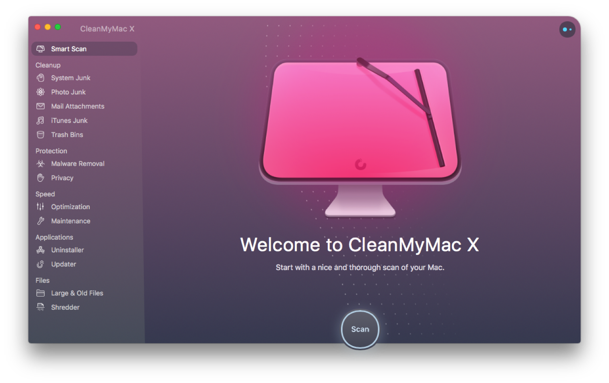

前面几篇文章介绍了 Mac 自带软件的一些不容易被发现的功能，还有一些实用的技巧。希望你在看完之后，能熟练使用 Mac 中自带的软件，因为很多功能都能通过自带软件来实现，就没有必要再去找各种软件了。

今天开始呢，要介绍一些第三方的软件了，一个电脑，没有软件或者只有自带的软件肯定是不够用的，我们当然要装很多软件来扩展功能了。总不能买个电脑供起来真当艺术品吧！不过如果你想当艺术品也行，可能要等个 10 年、8 年的，也不好说。

好了，进入正题：

## 解压软件：The Unarchive

`macOS` 默认情况下是有压缩和解压缩的，你右键选中一个文件夹或者 `.zip` 的文件，就能选择压缩或者解压缩。

如果你是给别人压缩，共享到其他设备，当然没有什么问题。然而你也总需要查看别人给的压缩包，`RAR`、`7-Zip`、

`ISO` 等文件，我数都数不过来，系统的解压就不好用了。

使用 `The Unarchive` 基本上能 hold 住你使用的场景，而且还免费，这么良心的软件哪里有下载呢？当然 `Mac App Store` 了：

## 截图工具：Jietu

你可能会说了，前面不是介绍了系统的截图嘛，又能截图还能录制屏幕，`QuickTime` 还可以录制手机屏幕，难道不香嘛？

说实话，截图工具经常使用，如果你只是截个图，偶尔简单编辑一下，那系统的绝对够用。然而如果你的量大之后，你会发现系统的编辑有点难受。

至少我一直用的添加文字、画框、画箭头，这些基础但是常用的功能，想调整位置和大小粗细都得摸索一会儿，别说大量的使用了。所以这个截图工具你值得拥有。另外他还可以录屏，并且导出为 `gif` 的格式，这样你在演示的时候非常方便。同样，在 `Mac App Store`有售，免费且好用哦！

## 邮件客户端：Spark

除了上面的截图，邮件客户端应该也是比较常用的了。系统自带的邮件客户端呢，只能算是基本款：没有颜值，而且也不怎么友好。所以找个颜值高又好用的客户端非常有必要。

之前我一直用网易邮箱大师，可是不知道从什么时候开始，Mac 的网易邮箱大师经常闪退。然而体验也没有那么好。虽然是国产的。

后来发现这个客户端之后，就一直使用了。`Mac` 、`iPhone` 的 `App Store` 都有哈，自行下载。

## 效率工具：Alfred

前面几篇文讲效率工具、系统自带的 `Spotlight`，把 Alfred 放到后面有点说不过去了。不过正因为他介绍的人多，比较重要，所以不容易被忽略，所以放中间也没啥问题吧？

`Alfred` 可以搜索文件、搜索通讯录等，也可以当作计算器，还可以控制系统设置、管理剪切板，另外最强的是它的 `Workflows`，解放鼠标点点点、键盘按按按的效率神器。一定要安装！

软件下载免费体验，高级功能像 `Workflows`需要收费，请按需购买。

官方网站：[https://www.alfredapp.com/](https://www.alfredapp.com/)

## 文本编辑器：Visual Studio Code 和 Sublime Text

不知为何，`Windows`和 `Mac` 自带的文本编辑器真的都很鸡肋，可能文本编辑不重要？

其实在平常使用过程中，文本编辑还是很多的，所以需要一个文本编辑的利器。

之前对微软是没有什么好感的，但是自从免费开源的 `Visual Studio Code`（简称 `VSCode`） 推出之后，另外收购 `GitHub` 私有仓库这两件事情，就蹭蹭蹭的圈粉呀。不得不说，真香。

`VSCode` 启动快，插件多，能满足你大部分的需求。另外它其实不只是个文本编辑器，很多编程的小伙伴可以拿他当作 IDE 使用，实际上它就是一个轻量的 IDE 呀。

下载地址：[https://code.visualstudio.com/](https://code.visualstudio.com/)

说到文本编辑器，不得不说 `Sublime Text`，没有前者强大，但是也可以安装插件，启动速度嗖嗖嗖啊，软件本身免费，但是不购买在保存的时候会弹框。所以看个人喜好选择了。

`Sublime Text`下载地址：[https://www.sublimetext.com/](https://www.sublimetext.com/)

如果颜值是你考虑的一个因素的话，不用担心，两个编辑器都可以安装主题，基本上都能配置成你喜欢的样子。

## 视频播放器：IINA

作为生（爱）产（奇）力（艺）的 `Mac`，怎么能少了视频播放器，介绍系统软件的时候，介绍过 `QuickTime Player`，作为视频播放的软件，又是一个软件的基本款：支持的视频格式少，也没有字幕。

`IINA ` 是一款开源的视频播放器，小巧、流畅，当然颜值也不输大部分的播放器。另外支持的视频格式也很多，支持在线字幕。你想要的网络播放器的功能，他基本上都有。可以算得上是 `Mac` 上最好的视频播放器了。

## 文章书写软件：Typora

如果你经常写文章，需要排版邮件，那么你之前使用 `Pages`、`Word` 之类的富文本编辑软件很多，但是如果你想专注于写作，而忘记所谓的排版的时候，`Markdown`的使用你一定不能错过。实际上 `Markdown` 是一种*轻量级的标记语言*，听到语言是不是想到了编程？不要慌，很简单的几个命令，就能写出优美排版的文章。另外，很多软件都提供了常用功能的设置：标题、链接、图片，不要太简单。如果想要了解更多，可以自行搜索 `Markdown` 的使用。

`Typora`是支持 `Markdown` 的一个软件，可以写出排版优美的文章。轻量、即时渲染，这是软件的特点。

另外软件可以直接使用第三方图床软件，一键上传本地的图片到图床，非常方便。

软件本身提供了一些主题，你还可以下载主题。如果你是高端玩家，完全可以自定义自己的样式 `CSS`，来简单的完成复杂的排版。例如我就是使用别人提供的主题，然后稍微作修改，用在了公众号的排版中。

下载地址：[https://typora.io/](https://typora.io/)

下面截取正在书写的文章截图：

## 快速查看扩展工具：Glance

如果你已经使用 `Mac` 一段时间了，肯定会对 `QuickLook` 有一定的了解，可能你没有听过这个名字，但是你肯定用过。

在选中一个文件之后，可以按空格键，这时候能预览文本文件或者其他支持的格式的文件。这就是`QuickLook`。

又有一个问题，`QuickLook`支持的文件很有限，大多数需要安装相应的应用才能查看，或者你需要下载相应的文件放到指定的目录。

`Glance` 这个软件呢，可以支持一些文件类型的预览，安装好之后就可以使用了，去`Mac App Store` 就可以找到，免费。

支持的文件类型如下：

特别是压缩文件，可以不解压的情况下，按空格键预览压缩文件里面的内容哦。

## 菜单栏管理工具：Bartender

如果你像我一样，装了太多的软件之后，会全部挤在菜单栏，导致菜单栏又多还不好看。

这时候你可能需要一个菜单栏的管理软件，可以按照自己的设置来隐藏和显示菜单栏的图片，不要太好用。

当然，软件收费，可以在[https://www.macbartender.com/](https://www.macbartender.com/)下载和购买哦。

## 投屏软件：AirServer

这个是投屏应用，你可能会说，投屏不是电脑自带的嘛，为啥还要装软件？

其实这个软件不是给 `Mac` 投屏的，是不是很惊讶，`Mac` 的软件不是给 `Mac` 用的，还能给谁用？

想把 `iPhone`、`iPad`、其他 `Mac` 的镜像投到你的 `Mac` 吗？装这个软件就能搞定，可以设置投屏密码，不会让谁都投上来。只要支持 `AirPlay`的设备，都可以投屏上来哦。

你可能又要问了？我用这个软件干啥呢？这个就要你去发现了，我是打游戏才时候感觉手机音效不好，想把声音投到电脑上。找了一会儿找到的这个软件，你可以

这个软件也有 Windows 的版本，另外这个软件收费，请按需购买。

官网地址：[https://www.airserver.com/](https://www.airserver.com/)

## 清理软件：CleanMyMac 和 Lemon

你可能又会问了，推荐了这么多，为啥没有管家、全家桶啥的？现在来说，`Mac` 基本上是不需要杀毒软件、安全卫士之类的东西的。可能使用 `Mac` 的人少吧，所以病毒感觉不值得，所以管家、卫士、全家桶就更觉得不值得了。

因为**不值得**这个原因，所以现在 `Mac` 上的流氓软件很少，基本上不用杀毒啥的。

但是有些软件的残留或者系统垃圾，肯定会有的。很多人都像我一样，没钱买个 256G 的 `Mac`，基本上装个软件还得看多大，多占空间。还有就是 `App` 卸载之后干净了没有。这时候就需要用到清理软件了。

另外这些软件可以监控系统的状态：CPU、内存的使用情况，也可以查找大文件、重复的文件，也可以卸载、清理软件，可以说是比较方便了。

老牌 `Mac` 清理软件 `CleanMyMac`，收费：[https://cleanmymac.macpaw.com/](https://cleanmymac.macpaw.com/)

腾讯出品的腾讯柠檬：[https://lemon.qq.com/](https://lemon.qq.com/)

说谁清理的好，我也没有比较过，另外我也不知道会不会有监控啥的，你知道某国特色。不过鹅厂的软件大部分比较良心吧，所以，个人感觉免费的柠檬够用了。另外鹅厂和老干妈的事情，真的有笑到我。

好了，到这里基本上一期的必备软件就介绍完了，基本上是大家都能用上的。

都看到这里了，可以关注了、点个赞再走嘛，好不好～