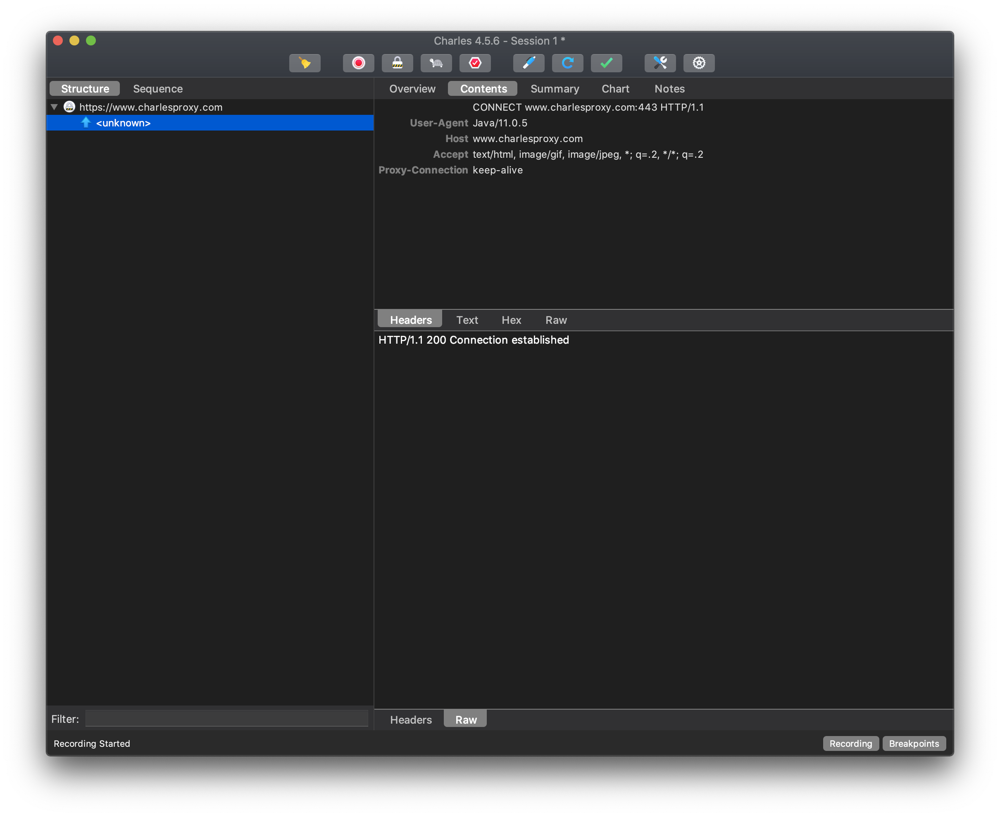

前面介绍了 `Mac` 必装的软件，适用于所有人，基本上所有人都会用到的软件。

今天介绍的软件，仅仅是为程序员准备的，可以说所有的工程师都离不开的软件集合。

如果你是一个普通用户或者没有看上篇内容，强烈建议去看一下！

因为用 `Mac` 的用户，要么是为了颜值，要么是为了写代码，这两者占大多数。

本文会分两部分介绍，第一部分是 `App`，就是有用户界面的程序；第二部分是 `shell`（命令行）工具，是在命令行中使用的。

毕竟程序员可不是只看外貌的，还很注重内在的修养哦！

# App 篇

## Xcode

你可能会说，这不是给*苹果系*开发者的吗？我又不做 `iOS`、`Mac`相关的开发，为什么上来就给我推荐 `Xcode`？不是在逗我吧？

当然不是，作为*苹果系*的御用开发工具，只要开发苹果相关的软件，就肯定离不开 `Xcode`。你可能会说，我是 `Java`、`PHP`甚至只是个前端工程师，有个文本编辑器就能搞定，为啥要用 `Xcode`？

因为很多命令行工具需要用到 `Command Line Tools`，在 `Mac` 下，这个工具肯定逃不开，而 `Xcode` 当然带了 `Command Line Tools`；另外， `GitHub` 上面很多给 `Mac` 和 `iOS`的开源软件，都需要自己编译和运行的，有了 `Xcode`，你就可以自己玩了呀。

`Xcode` 在 `Mac App Store` 就有，自己可以去下载。

当然，`Xcode` 比较大，`10G` 之多，如果你的空间比较吃紧，又不用的话，那就安装 `Command Line Tools` 就行了（安装方法：终端运行 `xcode-select --install` 命令就行了）。


## iTerm2

`Mac` 的优势之一就是用户界面和命令行的完美结合，让你既可以享受 `Mac` 妙曼身姿的时候，又可以深入了解一下 `Mac` 的内心。然而本身自带的 `终端.app` 颜值太低，而且我觉得是个开发人员就会经常使用终端，所以这个软件值得推荐。

软件的功能：

1. 有多种你喜欢的主题可以设置
2. 自动补全
3. 很好的分屏
4. 全局热键调出

总的来说，就是可以自定义的功能很多，软件免费。如果一直使用终端的话，建议安装。

官网：[https://www.iterm2.com/](https://www.iterm2.com/)


## VSCode

前面在介绍常用软件的时候，作为文本编辑器的软件介绍过。但是它真的不是一个简单的编辑器，它可以替代你使用的 `PyCharm`、`WebStorm` 等又大又臃肿的 `IDE`。因为它本身就是一个 `IDE`，还没有给自己设限，通过安装插件成为全能的 `IDE`。

说到插件，你可能会想到 `Eclipse`相对于 `IntelliJ IDEA` 那种繁琐和不好用。不过它不是的，你会很容易就能搭建自己的开发环境。

而且，免费开源！

官网地址：[https://code.visualstudio.com/](https://code.visualstudio.com/)

[](https://code.visualstudio.com/)

## Source Tree

说到开发，就想到了代码，说到代码，就想到了脚本，想到脚本，就想到了拍电视，中美合拍的西游记……

不好意思，原谅我跑偏了。

说到开发，就肯定就会到 `Git`，如果你们公司还在用 `SVN`，我建议你换个公司。

`Git` 作为目前世界上最先进的分布式版本控制系统（没有之一），基本上所有的公司都在使用。

即使你是个命令行重度用户，我觉得也需要有个 `GUI` 的 `Git` 客户端，因为看合并树和查找的时候很方便呀。

软件注册账号之后免费使用：[https://www.sourcetreeapp.com/](https://www.sourcetreeapp.com/)


## Charles

抓包工具，可以抓取 `HTTP`、`HTTPS` 等请求，是不可多得的调试利器。

甚至在其他 `App` 安全性低的情况下，能抓取所有的 `App` 网络请求。

其他设备可以代理到当前 `Mac`，然后实现其他设备的抓包。

收费软件，建议购买正版，官网地址：[https://www.charlesproxy.com/](https://www.charlesproxy.com/)



## ApiFox

如果你经常调试网络请求，那么怎么发送 `POST` 请求呢？总不能写个客户端，每次去改请求吧？

之前一直用的一个工具是 `Postman`。

然而不知道从什么时候开始，大家都开始推荐 `ApiFox`，所以我这儿就放上来吧。

大家都推荐它，就因为它比较新嘛？当然不是了。

`Postman`有的功能它都有，官方的介绍是：*接口文档、调试、Mock、自动化测试，提升 10 倍效率！*

另外还有：`Apifox = Postman + Swagger + Mock + JMeter`这个介绍。

免费下载：[https://www.apifox.cn/](https://www.apifox.cn/)


## OpenInTerminal

如果终端都一直用了，那是不是在某个文件夹打开终端也很常用呢？

`Windows`可以在资源管理器里面直接打开一个命令行窗口，但是 `Mac` 并没有。那是不是说明 `Mac` 比较弱呢？Emm……，我不说话。

如果你想在 `Finder` 或者右键菜单中有*在当前目录打开终端*的需求的话，那么这就是你要的东西。

开源免费，据说作者还是个学生，如果觉得不错可以赞助一下：

[https://github.com/Ji4n1ng/OpenInTerminal](https://github.com/Ji4n1ng/OpenInTerminal)


## Beyond Compare

如果你有很坑的队友，不怎么喜欢用 `Git`，或者你总是有一坨文件需要比较，看看哪里更改了，哪里需要统一合并进来。

那么你需要两个文件（或者文件夹）的比较功能，这个软件就可以帮你。

文本文件可以帮你找出文本文件的不同之处，也可以用来合并两个文件夹或者文件。

软件收费，请按需购买：[https://www.scootersoftware.com/](https://www.scootersoftware.com/)

如果打不开，请相信这个网址没有问题，是某种原因可能让他不可访问了，你可以使用搜索引擎搜索来安装。


## Dash

一个 `API` 查询工具，具体功能如下：

1. **离线文档**：`API` 索引，包含很多语言及库的 `API` 开发文档，还有官方入门教程；
2. **IDE集成**：与各个工具及编辑器 、`IDE` 无缝集成，包括 `JetBrain` 全套、`Xcode`、`Alfred` 等；
3. **自定义数据来源**：包含 `Google`、`Stack Overflow` 地址，你还可以自定义来自诸如 `Medium`、`Quora` 等任何你需要的网站；
4. **注释功能**：方便快速的注释、标记功能。

如果你是个全栈工程师，又常常需要查询各种 `API`，那么这个工具你一定用的上。

软件本身免费，但是会时不时的在查找新文档的时候，有 `10s` 的等待，下载地址：

[https://kapeli.com/dash](https://kapeli.com/dash)


# Shell（命令行）工具

> 上面也说了，`Mac`的优势之一就是用户界面和命令行的完美结合。说完了 `App`，当然后面就是命令行工具了。
>
> 有了命令行工具 `Mac` 才更完美。

## Homebrew

`Homebrew` 是 `macOS` 优秀的包管理工具。官方给的中文说明是：*使用 Homebrew 安装 Apple 没有预装但你需要的东西。*

`Homebrew` 完全基于 `Git` 和 `Ruby`（这两个东西 `Mac` 都自带了），可以实现你需要的包管理。

安装方法，当然是在终端（或者上面提到的 `iTerm2`）安装了，运行命令：

```shell
/bin/bash -c "$(curl -fsSL https://raw.githubusercontent.com/Homebrew/install/master/install.sh)"
```

等待完成就可以了。虽然 `Homebrew` 是命令行工具，但是可以安装命令行软件和一般使用的 `App`。

使用方法很简单：

1. 在终端执行`brew install xxx` 安装想要的命令行工具；
2. 执行 `brew cask install xxx`安装想要的各种 `App`。

（记得将 `xxx` 换成你要的软件，例如：`brew install wget`、`brew cask install firefox`）。

如果你没有第一个推荐的 `Xcode`（`Command Line Tools`），那么首先会安装 `Command Line Tools`。所以建议开箱先安装 `Command Line Tools` 和 `Homebrew` 哦。

官网地址很好记：[https://brew.sh/](https://brew.sh/)。当然也是免费的喽。


## zsh + Oh My Zsh

看到我上面使用的 `iTerm`，你是不是会想为啥和你使用的不太一样呢？因为要配置呀！

先说 `shell`，`shell` 有很多种，之前 `macOS` 默认的 `shell` 是 `Bash`，从 `macOS Catalina`之后，默认的 `shell` 就换成 `zsh` 了。

`zsh` 相对于 `Bash` 来说，基本上所有 `Bash` 的功能，但是前者可以安装各种插件，支持配置别名、各种补全（路径、命令、命令参数、插件内容）。

基本上 `zsh` 开箱直接使用，但是配置就比较麻烦了，于是就有人帮我们配置好了，那就是 `Oh My Zsh`。

安装 `Oh My Zsh` 的方法是在终端中输入下面命令并回车：

```
sh -c "$(curl -fsSL https://raw.github.com/ohmyzsh/ohmyzsh/master/tools/install.sh)"
```

有了这两个神器之后，不仅你的 `Mac` 可以起飞了，你的终端也可以单独起飞了。

你当然装完之后可以安装各种主题和插件了，从 `VSCode` 你就应该看得出来，能安装插件是多么厉害的一件事情。

地址：[https://ohmyz.sh/](https://ohmyz.sh/)

另外安装完成之后，可以搜搜这两个插件：`zsh-autosuggestions`（命令建议插件，可以建议之前输入过的命令）、`zsh-syntax-highlighting`（语法高亮插件，可以根据颜色提醒你命令输入错误没有）


## The Fuck

这个名字有点不优雅，因为我们大部分是相信看到的，你在使用终端时候，有很多“不优雅”的提示让我们不知道如何是好。

有很多时候，我们遇到命令出错或者没有相关命令的时候，我们还要安装相关的工具。

`The Fuck` 为我们提供了一种很简单的方法，运行上个命令出错了，那么输入 `fuck` 运行之后，会发现能帮我们解决命令不存在的问题、命令错误的问题。

用了都说好：[https://github.com/nvbn/thefuck](https://github.com/nvbn/thefuck)


## autojump

终端里面的一个问题，就是要进入的文件名太长，我们得一个一个输入，要么就是用上面提到的 `OpenInTerminal`，来打开想要的目录，但是还是需要在 `Finder` 中找到这个路径。

这时候就该 `autojump` 登场了。

安装配置完成之后，就可以通过 `j xxx`（注意将 `xxx` 换成你自己的路径，例如：`j myDirectoryName`）来跳转。

后面的文件名输错或者仅有一部分都没有关系，这么强大的东西当然是通过按 `Tab` 键来补全了呀。

地址：[https://github.com/wting/autojump](https://github.com/wting/autojump)

图片就不放了，安装完成之后自己去跳试试吧！

# 最后

感觉没有怎么写呢，就又这么长了，今天先到这里吧，希望你玩的开心。

另外，如果有想要了解的软件或者技术，欢迎留言哦，我这么好，会尽量满足你的需求哒！

