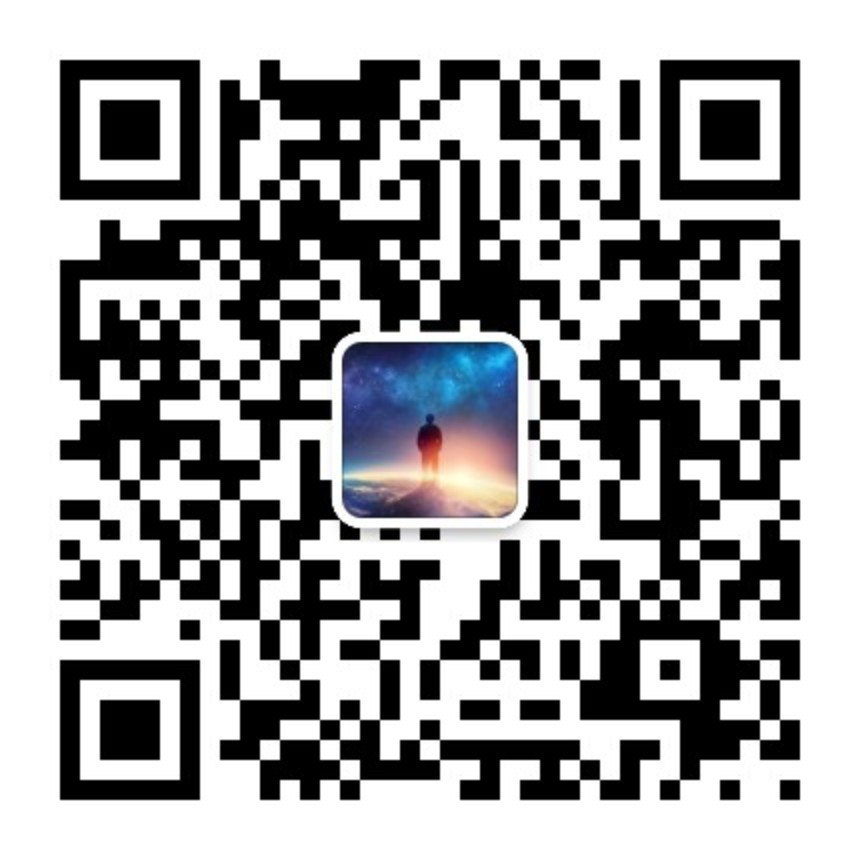

> 苦难就是苦难，本身并没有任何意义，对于痛苦的思考才是有意义的，才会使人真正的成长。

冬天已经结束，春天加快了脚步，现在我们已经在和夏天相处了。

没有永远的冬天，也没有到不了的明天。

看到五一期间各个旅游景点人都很多的情况下，我相信这次也会很快过去的。

经历过这次疫情之后，大家都有很多的感触。

有感叹要多陪陪家人的，有感叹世事无常的，有说要更加努力赚钱的。

那么我们究竟应该从这次无意义的苦难中，得到什么样有用的启示呢？

# 1

在疫情前，你有没有幻想过，如果生活一直这样下去，就可以了：现在的工作赚的钱也还可以，虽然算不上多，但是也不算少。如果能一直维持就可以。

事实证明，**生活不会就一直这样下去的，无论好坏**。

如果我们不努力，那么现在拥有的这一切，就是从今以后最好的东西了；现在的时光，就是往后余生最美好的时光了。

**我们需要不断的努力，才能维持现在的这种生活**。

在家自我隔离了一段时间后，许多人都感叹：“**原来不是工作需要我们，是我们需要工作**”。

是的，除了我们自己和家人，没有人需要我们：你现在能在公司有个职位、有点收入，这其实也不能一直维持的。

工作是为了赚钱，赚钱是为了生活。

在没有足够的钱的时候（钱应该永远都不够），不要想着浪迹天涯，因为浪迹天涯也需要钱。

**努力工作，照顾好家人**。

# 2

不是所有的人都那么幸运的，现在的情况，拥有工作这件事情都变的很奢侈。

有好多公司发不出工资，只能申请破产，员工不仅没有赔偿，还有几个月工资没有发。

那也没有办法，只能硬着头皮继续找工作。

因为还有房贷、车贷要还，家庭还有许多开支。

看着在一二线城市有房有车，应该算是中产家庭了吧。其实完全不敢把工作给丢了，因为工作是唯一的收入。

现在唯一能做的，就是**继续找工作**，不要灰心，总会找到一个合适的。

也可以先找一个不是多么满意的工作，先稳定收入，后面好一点的时候再考虑换。

# 3

可能很多人会觉得：我的生活不应该是这样。

就像我们当年刚毕业，几个同学一起到上海，感觉整个上海都是我们的。

然而混了几年之后才发现，现在连自己都不是我们自己的。公司让加班就加班，公司让 996 就 996，有时候周末甚至都没有自己的时间。

别说改变世界了，我现在只想改变我自己。

然而没有非工作收入，工作不敢辞，啥都做不了。

所以现在也一样，如果想从工作中脱离出来，如果想遇到失业不再恐慌。最好的办法，就是有**睡后收入**。说白了，就是**干点副业**。

除了工作的收入，如果有自己的副业，而且工作收入占总收入的比例不到一半，甚至更少，这时候你遇到裁员、待业的其实就一点都不慌了。

怎么找副业呢，我觉得有两个方向：要么**做自己喜欢的事情**；要么**做自己擅长的事情**。

如果这两种情况正好是一件事情，那么恭喜你，你很幸运。

就算现在这些事情还不能让你有收入，但是可以先培养起来，慢慢的做起来。

一口吃不成胖子的，所以前面两部分，还是让你努力工作，如果没有工作的赶快找个工作。闲下来的时间，才是你的做副业的时间。

而且，不建议你去做一些收效甚微的，或者说没有**复利**的东西，你做的东西能一直在以后使用，并且对以后的发展有帮助的副业。

比方说发传单、送快递、送外卖，虽然看着也是很努力，也是在努力的做副业，但是却靠的是体力。对你的工作或者以后的生活上来说并没有很大的帮助。

这里不是说发传单、送快递、送外卖不好，如果你是想开个自己的快递、外卖公司，或者以后能通过这时候的经历来帮助自己做选择，也是非常好的。

做副业除了能有一点收入之外，还是你工作的保障，如果被辞退了，还能拿副业当主业来做，一点都不慌。

总之：**能对现在或以后的工作有帮助，或者能培养自己兴趣、爱好，亦或能通过做的事情赚钱的，都是好的副业**。

# 4

目前的经济形势还很严峻，自己一定要开源节流。开源就是上面说的做副业，然后多挣钱。

节流呢，就是**消费方式要适当降级**了。

之前可买可不买的，考虑到“现在不买，以后有钱了也没有这心情了”的想法，大部分就买了。

现在不能这样了，能不买的就不买，能省的就省，现金流比那些东西更重要。

还是那句话：等过完这一段艰难的时光，经济形势好了之后，再去享受生活吧——现在对大部分人来说，活着更重要。

# 5

要有一个健康的身体。

虽然我是最后说健康这一项的，但并不是因为不重要。

恰恰相反，我是想强调一下：**健康的身体真的很重要**。

疫情发生的时候，相同的环境，有些人能安然无恙，而有些人却被感染，是因为抵抗力的不同；后续治疗过程中，有些人很快能康复，有些人却迟迟痊愈不了，是因为身体素质不一样。

一个健康的身体，才能支撑自己在工作赚钱，才能支撑自己做自己喜欢的事情。

所以，在平常的时候注意保护自己的身体，不要熬夜，吃饭要规律。

就像这次疫情，在所有药都不奏效的时候，是你健康的身体在同病毒作斗争。

# 最后

**没有工作的找工作；有工作的努力工作；工作之余发展好自己的副业**。

只有有钱了，才能照顾好自己；只有有钱了，才有底气没有工作也不慌。

愿你能遇见更优秀的自己，过上自己期望的生活！

如果有需要，欢迎关注我的公众号：

