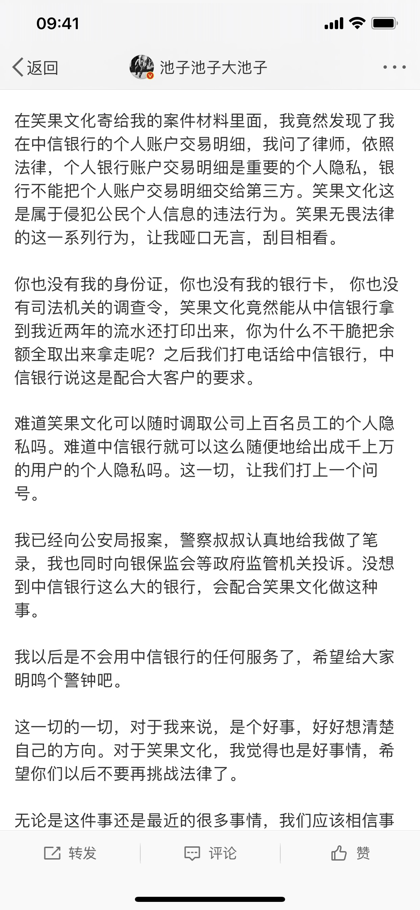
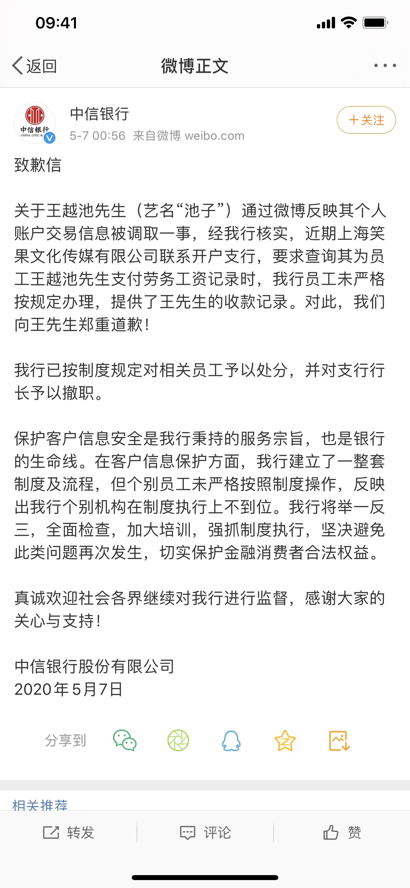

经历过昨天中信银行的事情，你还觉得自己的隐私够安全吗？

很多人可能不知道发生了什么事，简单说一下。

如果你喜欢脱口秀，或者身边有人看脱口秀的话，《吐槽大会》、《脱口秀大会》这些节目一定听说过，那么池子这个人应该也不陌生：他一个比较火的脱口秀演员，最近有一段时间没有登台了，关注他的人可能也觉得纳闷。今天终于出来说了一下，原来最近是在和笑果文化打官司，所以就也没有精力露面了。

池子跟笑果文化的纠纷其实很简单，大致就是艺人成名之后想换个更好的平台，或者想脱离经纪公司的掌控。这在娱乐圈应该很常见，目前也说不好谁对谁错。

不过我看到的一点是，这里面竟然有中信银行的事情，池子微博的原文如下：

说简单点，就是中信银行所谓的“配合大客户的要求”，把人家两年的流水都打印了出来。

在如今去哪儿都是手机支付的情况下，两年的流水，那不是干了些什么事都能知道了？

也许你会说“他说什么就是什么喽？”。然而中信银行也出来道歉了：

微博时间是今天凌晨 00:56，可以善意的认为是加班加点在处理了。

中信银行的道歉有两点：1. 承认了员工“未严格按规定办理”而泄漏用户账户隐私问题；2. 对支行行长撤职处理。

池子在微博中说，公司没有查询他个人账户流水的条件，这是符合的。

我咨询了律师朋友，还有看到记者采访某国有银行的客户经理，确定了查询个人银行账户流水的条件这几种：**本人凭借有效证件查询**；**公检法等部门出具相应的证明查询**；通过**自主回单机，有银行卡和密码就可以查询**；**有正规的流程和审批**（比方说员工和公司签订的劳动合同或者协议里面，有授权查询银行流水的条款）。

显然这次事件上面这些条件都不符合。

说实话，银行的保密系统、制度，理应是优于其他大部分的系统的，但是还是出了这样一件事情，让我们怎么能放心？

虽然这事只看到了一次，谁知道真正发生的有多少呢？这还是一个知名的人暴露出来的，如果是一个平常的人，他的声音能让大家知道这样一个事件吗？

所以，**对于隐私的保护，永远不要太乐观**。

“中国人对隐私问题的态度更开放，也相对来说没那么敏感。如果他们可以用隐私换取便利、安全或者效率。在很多情况下，他们就愿意这么做。”

这段话还记得吗？有没有觉得自己的隐私已经完全在不知情的情况下，被不知道多少人、不知道多少次利用了？

说实话，这真的让我很吃惊。

不过，这件事情的持续发酵，银保监会已经介入调查，相信会有一个公正的结果。也希望不再有这样的事情发生。

说了这么多，我到底想说什么呢？

**尽最大的努力保护自己的隐私**。

一个是在自己可控的范围内，要尽可能的注重自己的隐私保护：比方说现在电子产品随处可见的时候，宁愿使用系统自带的输入法，也不愿意用其他可能造成隐私泄漏的第三方输入法。虽然不确定系统就不会把你的信息给“公开了”，但少一个环节，就少一次的风险。

另一个是遇到有侵犯自己隐私的事情，比如说如果你遇到上面的情况，请拿起法律的武器，不要让这些非法的行为得逞。

最后，愿**隐私**这两个字，能对得起这两个字的意义。