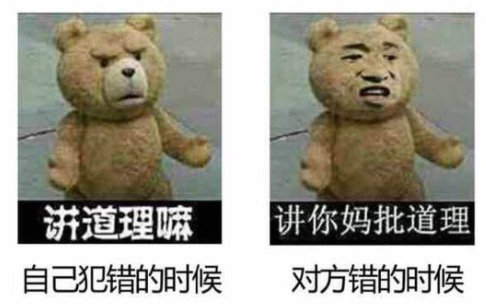

相信很多人的梦想就是：

有很多的钱，

然后移民美利坚。

美国的月亮比较圆吗？当然！

## 美国民主平等

很多人鼓吹美国民主平等，因为整天把“天赋人权”、“人生而平等”等挂在嘴上。

你可能也在电视、电影上看到过类似的说法：

总统和清洁工是一样的；华尔街精英和流浪汉也没有什么差别；黑人和白人享有相同的权利；任何人都是平等的，没有什么高低贵贱之分，只是工种不同而已。

这种话一直说就会让人相信了，就像某种洗脑的组织一样，所以处于底层的人很相信这种话。

可实际的情况呢？这是美国的“愚民政策”，就是为了让你相信而已。

距离1963年，马丁·路德·金著名的《我有一个梦想》的演讲已经过去 50 多年了，然而现在的平等，大部分还是停留在口头上。

这就是为什么*美国明尼苏达州暴力骚乱*会迅速蔓延到 30 个城市：因为此次的事件不是个例。

## 美国言论自由

你可能会说：美国言论自由，可以随便说话。

然而最近的事实又是怎么样的呢？

还记得刚过去不久，我国香港问题发生的时候，美国的社交媒体是怎么做的吗？

大量删除中国的社交账号，去年（2019年）8月20日中国外交部发言人耿爽也抨击了这种行为。

然而毕竟主动权在人家手上，也只能强烈谴责而已。

如果你觉得去年很远了，那么这次事件也有个小插曲：

> (2020年)5月28日，美国总统签署了一项针对推特等社交媒体的行政命令，试图推动联邦通讯委员会(FCC)修改《通讯传播正当行为法》的第230条款，以限制社交媒体的内容审查权力。命令称，大型社交媒体企业审查他们不赞成的意见时，是在行使一种危险的权力。推特、脸书等企业在解读公共事件时行使着巨大权力，审查、删除信息或屏蔽，以控制给公众阅读的内容。
>
> ——腾讯网《总统与推特的战争》

先不说这个行政命令有没有作用，通过这几次的事件，你应该明白：

言论自由都是人家说了算的：让你自由才自由，不让你自由你连嘴都张不了。

讨论这种事，太难受了，放一个表情吧，完美的诠释了这种双标：

## 美国公平正义

还记得美国怎么打压中兴、华为的吗？

先不说华为公司怎么样啊，之前爆出来的劳动纠纷、任总说的没有 996 等，也不好评判。

毕竟这种事情也很多，而且一个公司需要生存，难免会有一些处理不好的地方。

但是在这种遭受别国打压的情况下，很有可能我国的技术会遭受重创。

在这种民族大义面前，相信大家肯定不会站错队的。

那么美国为什么一面的仁义道德，一面又是这种吃相呢？

因为美国本来就是出了名的双标，因为华为代表了中国的技术水平。

美国和中国的技术竞争，如果用大人和小孩打架来做类比的话，如果这个小孩5、6岁，大人肯定会说我们是平等的，我们可以竞争，我还可以教你一些打架的技巧；但是这个孩子长到 20 岁左右之后，大人想要打得过这个年轻人，只能是限制这个年轻人的发展了，别说教你东西了，现在都不敢让你再吃饭了。

我国现在在芯片和操作系统领域，真的只是刚刚起步，完全是在被人家碾压，被人家打还没有还手之力。

但是美国还是怕我们发展起来，所以美国的限制令更严重了；因为这个大人看出来了：年轻人很强壮，到时候肯定自己打不过，不过可以想办法，让他还没长大的时候营养不良。

现在华为没有办法，唯一能做的，只能是在限制令到来之前多囤货。

## 最后

月盈则亏，水满则溢。

虽然现在美国还处于领跑的地位，但是他们的面目正在被所有国家和民族看到。

我们只有奋起直追，因为我们的差距确实很大。

除却美国现在内部自己乱了阵脚以外，其他国家和民族也会努力不被别人压制的。

所以，美国的月亮确实很圆，只是对人家自己、可以看到月亮的人来说。

因为对于其他人来说，人家的月亮根本都不让你看到。