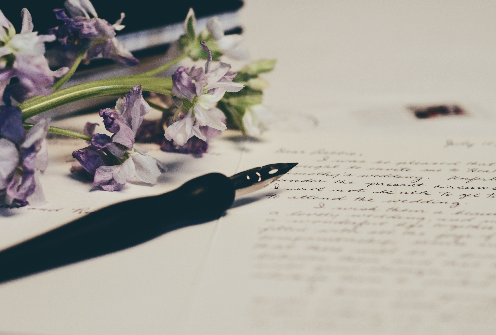

写文章确实挺难的。

——这是我从开始写到现在，这几个月的感悟。

# 1

之前上学，不怎么害怕写作文：因为啥都没有经历过，反正都是胡编乱造的。

里面的故事、经历、对话和想法，基本上都是“别人的”。

那时候也不用“我一个朋友”、“我一个同学”之类的话开头。

然而写的作文，大部分都是书里、电视上看到的，说的都是别人说的。

所以我写不好作文。

看到那些“高考满分作文”、“优秀作文”的好文章，一定会想象一下别人的经历和阅历。

我也很想和别人一样，能读很多的书，有很多的经历，有很多的阅历。

然而我没有。

除了那些聪明的和有钱的人，周围的人大多都像我一样，在学校就是学习，没有时间看课外书，也没有机会去北京、上海“见过世面”。

甚至在我读高中之前，去县城的次数都是能数的过来的。

**没有经历和阅历，就没有想法，当然就没有办法写出来好的文章。**

就像罗永浩老师说的：

> 退学以后，我在家里痛痛快快地读了三年闲书，没有方向、目标、计划，就是瞎读，读了三年的课外书。
>
> ……
>
> 我见到我同龄的那些老同学老朋友，发现他们在学校跟我读得差不多。
> 比如我在家里读鲁迅，他们上课也是读鲁迅，我读的是《鲁迅全集》，他们读的是鲁迅的某一篇文章。。。的节选！所以我就很自信嘛。
>
> ——《生命不息，折腾不止》-罗永浩

我就是罗老师口中的“他们”，而且读的还一点都不好。

这怎么能写好文章？

# 2

上了大学和工作之后，可以说是有很多自己的时间了。

这时候倒是读了一些书。

然而自我感觉量还是不够，也没有形成系统的认知。

总是看到别人推荐什么，就去读什么，也没有自己的一些计划。

这就导致自己很被动，很多知识都没有形成自己的体系。

体系没有形成，就不容易内化到自己的认知里面。

这些知识没有内化，那就表达不出来。

即使真的要表达，也是零零散散的，逻辑关联可能会差很多。

再加上自己本不是个文字工作者，又偏偏要写一些文章，这就更有难度了。

但是写文章这么难，我是没有想到的。

有时候我会在电脑前面坐两天，然而一点头绪都没有：

不知道自己要传递什么思想，不知道自己要输出什么内容。

然而又不能像小时候写作文那样编一些有的没的——因为我还是想要把每一篇、每一段、每一个词写好的。

有时候会想：这种状态是不能用“江郎才尽”这种词，因为在“才尽”前，江郎还是有才的，然而我呢？

所以，写文章真难！

# 3

那我究竟是为什么要这么想不开，给自己找不痛快，要开始写文章呢？

其实本来我也不想的，写文章对我来说，比写代码都难。

而且写了也只有很少的人看，自己找不痛快呢？

但是，这只是一个开始。

我见到过颠倒黑白的文章；

我见到过粗俗不堪的文章；

我见到过自以为是的文章；

我见到过无病呻吟的文章，

我见到过哗众取宠的文章。

当然，

我也见到过力透纸背的文章。

你在看到一些“标题党”、“小编体”之类的文章的时候，你难道没有一种“这都算文章”的感叹？

你在看到一些文笔犀利的文章之后，你是不是也会想“如果我也能写成这样就好了”？

正是对于那些垃圾文的不屑，和对好文章的追求，促使我开始想写点东西。

我不敢保证自己写的每篇文章都好，但是我总能让自己向好的方向发展。

大言不惭的说：**让这个文字的世界，希望因为有我，能变得好那么一点点**。

哪怕只是一点点。

# 4

不是所有人开始就能做的很好的，但是总要有个开始。

如果现在还不开始，还要等到什么时候？

